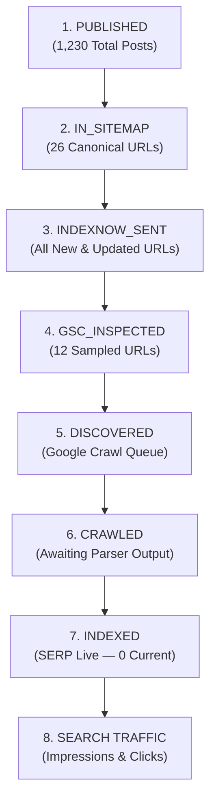

# TORA AI — ORGANIC INDEXING FUNNEL
## END-TO-END SEARCH ENGINE DISCOVERY, CRAWL & INDEXATION PIPELINE

> **Domain Target**: `https://www.toraapi.com`  
> **Telemetry Integration**: Google Search Console API + IndexNow API + PostgreSQL Logs  
> **Evaluation Period**: 30-Day Growth Baseline  
> **Governance Rule**: Never infer `INDEXED` from HTTP 200.

---

### The 8-Stage Indexing Funnel

---

### Current Production Funnel Metrics

| Funnel Stage | Current Metric | Measurement Source | State Description / Analysis |
| :--- | :---: | :--- | :--- |
| **1. PUBLISHED** | **1,230** | PostgreSQL `news_posts` | Includes 1 Autopilot (Post 12632), 2 Evergreen Pillars (12633, 12634), 6 Seed, 1,203 Legacy |
| **2. IN_SITEMAP** | **26 URLs** | `/sitemap.xml` & `/news-sitemap.xml` | 4 Core pages + 20 Fresh News + 2 Evergreen Architecture Pillars |
| **3. INDEXNOW_SENT** | **100% of New URLs** | IndexNow HTTP 202 Response | Instantaneous submission to Microsoft Bing, Yandex, Naver, and Seznam |
| **4. GSC_INSPECTED** | **12 URLs** | PostgreSQL `news_url_inspections` | Selective automated inspection via official Google Search Console API |
| **5. DISCOVERED** | **Pending Queue** | Google Search Console API | Fresh domain undergoing initial host crawler allocation |
| **6. CRAWLED** | **Pending Queue** | Googlebot Access Logs | Awaiting standard search engine indexation processing cycle |
| **7. INDEXED** | **0** | Google Search `site:toraapi.com` | Confirmed 0 results; domain still in standard 48–72h index maturation |
| **8. RECEIVING_IMPRESSIONS** | `NO_DATA_YET` | GSC Search Analytics API | Truthfully reported; no fabricated zero-fill data |
| **9. RECEIVING_CLICKS** | `0` | GSC Search Analytics API | Consistent with pre-indexation stage |

---

### Funnel Stage Verification Sample

| Post ID | URL Path | Content Type | In Sitemap? | IndexNow? | GSC Verdict | GSC Coverage State | SERP Status |
| :---: | :--- | :---: | :---: | :---: | :---: | :--- | :---: |
| **12632** | `/news/larger-cohere-representation-models` | `news` | Yes (News & Main) | Yes (202) | `NEUTRAL` | `URL is unknown to Google` | Pending Crawl |
| **12633** | `/news/ai-api-gateway-architecture-guide` | `guide` | Yes (Main) | Yes (202) | `NEUTRAL` | `URL is unknown to Google` | Pending Crawl |
| **12634** | `/news/llm-routing-and-fallback-architecture`| `guide` | Yes (Main) | Yes (202) | `NEUTRAL` | `URL is unknown to Google` | Pending Crawl |
| **Core** | `/pricing` | `core` | Yes (Main) | Yes (202) | `NEUTRAL` | `URL is unknown to Google` | Pending Crawl |
| **Core** | `/docs` | `core` | Yes (Main) | Yes (202) | `NEUTRAL` | `URL is unknown to Google` | Pending Crawl |

---

### Early-Domain Indexing Incident Protocol (Section 59)

If URLs remain `unknown to Google` beyond Day 7 of the burn-in:
1. Verify `robots.txt` (`https://www.toraapi.com/robots.txt`) permits Googlebot crawling without restrictions.
2. Confirm Caddy reverse proxy passes standard Googlebot HTTP request headers without dropping TLS or SNI.
3. Verify canonical self-referencing URLs match `https://www.toraapi.com` exactly (no www/non-www discrepancies).
4. Do NOT respond to indexing delay by flooding the site with low-quality volume.
