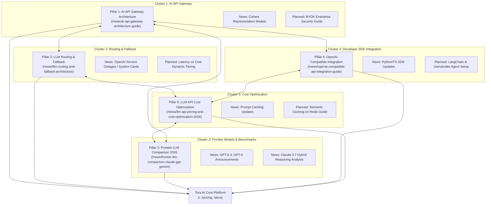

# TORA AI — TOPICAL AUTHORITY MAP
## CLUSTER ARCHITECTURE, EVERGREEN PILLARS & INTERNAL LINK GRAPH

> **Domain Target**: `https://www.toraapi.com`  
> **Authority Strategy**: Hub-and-Spoke Topical Architecture  
> **Current Live Pillars**: 5 Production Guides  
> **Last Updated**: 2026-10-06 (Overnight Autonomous Session)

---

### 1. Topical Authority Topology (Mermaid)

---

### 2. Comprehensive Cluster Breakdown

#### Cluster 1: AI API Gateway & Enterprise Multi-Provider Infrastructure
* **Target Intent**: Commercial Investigation / High-Intent Architectural Research
* **Primary Pillar**: `https://www.toraapi.com/news/ai-api-gateway-architecture-guide`
* **Status**: **LIVE / HTTP 200 / VERIFIED**
* **Target Queries**:
  * `ai api gateway คืออะไร`
  * `เกตเวย์ ai รองรับหลายโมเดล`
  * `enterprise ai proxy multi provider`
* **Target Conversion**:
  * Primary: [Tora AI Product Gateway](https://www.toraapi.com/)
  * Secondary: [Tora Developer Documentation](https://www.toraapi.com/docs)
* **Inbound Supporting Links**:
  * `/news/llm-routing-and-fallback-architecture`
  * `/news/openai-compatible-api-integration-guide`
  * Daily autopilot news covering enterprise provider announcements

---

#### Cluster 2: LLM Routing, High Availability & Dynamic Fallback
* **Target Intent**: Technical Problem-Solving / Reliability Engineering
* **Primary Pillar**: `https://www.toraapi.com/news/llm-routing-and-fallback-architecture`
* **Status**: **LIVE / HTTP 200 / VERIFIED**
* **Target Queries**:
  * `llm fallback architecture`
  * `วิธีแก้ openai api rate limit 429`
  * `dynamic routing multi llm`
* **Target Conversion**:
  * Primary: [Tora API Pricing](https://www.toraapi.com/pricing)
  * Secondary: [Tora Developer Documentation](https://www.toraapi.com/docs)
* **Inbound Supporting Links**:
  * `/news/ai-api-gateway-architecture-guide`
  * `/news/llm-api-pricing-and-cost-optimization-2026`
  * Outage/status changelog news items

---

#### Cluster 3: Frontier LLM Benchmarks, Reasoning & Evaluation
* **Target Intent**: Model Comparison / Evaluation & Selection
* **Primary Pillar**: `https://www.toraapi.com/news/frontier-llm-comparison-claude-gpt-gemini`
* **Status**: **LIVE / HTTP 200 / VERIFIED**
* **Target Queries**:
  * `เปรียบเทียบ claude 3.7 กับ gpt-4o`
  * `โมเดล ai ตัวไหนดีที่สุด 2026`
  * `gemini 2.5 flash ราคา ประสิทธิภาพ`
  * `ai ภาษาไทย tokenization comparison`
* **Target Conversion**:
  * Primary: [Tora AI Multi-Model Playground](https://www.toraapi.com/)
  * Secondary: [Tora API Pricing](https://www.toraapi.com/pricing)
* **Inbound Supporting Links**:
  * `/news/openai-compatible-api-integration-guide`
  * `/news/llm-api-pricing-and-cost-optimization-2026`
  * Model launch news (OpenAI Sol/Luna, Cohere models)

---

#### Cluster 4: Developer SDK Integration & Drop-In Replacement
* **Target Intent**: Immediate Implementation / Transactional Developer Utility
* **Primary Pillar**: `https://www.toraapi.com/news/openai-compatible-api-integration-guide`
* **Status**: **LIVE / HTTP 200 / VERIFIED**
* **Target Queries**:
  * `openai compatible api python ตัวอย่าง`
  * `วิธีใช้ openai sdk กับ claude`
  * `ต่อ openai base url ไป gateway`
  * `typescript openai compatible library`
* **Target Conversion**:
  * Primary: [Tora Developer Documentation](https://www.toraapi.com/docs)
  * Secondary: [Tora API Key Generation Console](https://www.toraapi.com/)
* **Inbound Supporting Links**:
  * `/news/ai-api-gateway-architecture-guide`
  * `/news/llm-api-pricing-and-cost-optimization-2026`

---

#### Cluster 5: LLM API Cost Optimization & Token Economics
* **Target Intent**: Financial Efficiency / CTO / Lead Engineer Decision Making
* **Primary Pillar**: `https://www.toraapi.com/news/llm-api-pricing-and-cost-optimization-2026`
* **Status**: **LIVE / HTTP 200 / VERIFIED**
* **Target Queries**:
  * `ลดต้นทุน llm api`
  * `prompt caching วิธีใช้ ประหยัดเงิน`
  * `คำนวณราคา token ภาษาไทย`
  * `semantic caching llm redis`
* **Target Conversion**:
  * Primary: [Tora API Pricing](https://www.toraapi.com/pricing)
  * Secondary: [Tora AI Cost Optimization Console](https://www.toraapi.com/)
* **Inbound Supporting Links**:
  * `/news/frontier-llm-comparison-claude-gpt-gemini`
  * `/news/llm-routing-and-fallback-architecture`

---

### 3. Internal Link Matrix & Cross-Referencing Rules

| Source Page | Required Outbound Anchor Links | Target Purpose |
| :--- | :--- | :--- |
| **Pillar 1** (`ai-api-gateway-architecture-guide`) | - `/news/llm-routing-and-fallback-architecture` - `/news/openai-compatible-api-integration-guide` - `/pricing` - `/docs` | Hub anchor linking to routing mechanics, developer drop-in SDK, and core product documentation. |
| **Pillar 2** (`llm-routing-and-fallback-architecture`) | - `/news/ai-api-gateway-architecture-guide` - `/news/llm-api-pricing-and-cost-optimization-2026` - `/pricing` | Connects routing and resiliency directly to cost optimization and transparent pricing tiers. |
| **Pillar 3** (`frontier-llm-comparison-claude-gpt-gemini`) | - `/news/ai-api-gateway-architecture-guide` - `/news/openai-compatible-api-integration-guide` - `/pricing` | Converts model comparison intent into unified gateway usage and transparent model cost evaluation. |
| **Pillar 4** (`openai-compatible-api-integration-guide`) | - `/news/ai-api-gateway-architecture-guide` - `/news/frontier-llm-comparison-claude-gpt-gemini` - `/docs` | Provides developers immediate copy-paste code snippets with direct paths to API documentation. |
| **Pillar 5** (`llm-api-pricing-and-cost-optimization-2026`) | - `/news/openai-compatible-api-integration-guide` - `/news/llm-routing-and-fallback-architecture` - `/pricing` | Connects token savings to Tora's multi-tier routing architecture and credit structure. |
| **Daily Autopilot News** | - Relevant Pillar URL (matching category) - `https://www.toraapi.com/news` - `https://www.toraapi.com/` | Passes fresh crawl equity from daily newsroom publications directly into the evergreen pillar hubs. |

---

### 4. Cannibalization Defense & Slug Invariant

1. **Unique Query Targeting**:
   * No two pillars target identical primary keywords.
   * Pillar 1 = Architecture & Infrastructure Gateway.
   * Pillar 2 = Routing, Latency & Fallback Failover.
   * Pillar 3 = Comparative Model Benchmarks & Specs.
   * Pillar 4 = SDK Implementation & Developer Integration.
   * Pillar 5 = Cost Pruning, Caching & Token Economics.
2. **Canonical Exclusivity**:
   * Every pillar has a strict, self-referencing canonical URL (`https://www.toraapi.com/news/{slug}`).
   * No pagination parameters, query strings, or hash fragments are indexed.
3. **No Legacy Collisions**:
   * All 5 slugs are verified completely distinct from legacy news items.
