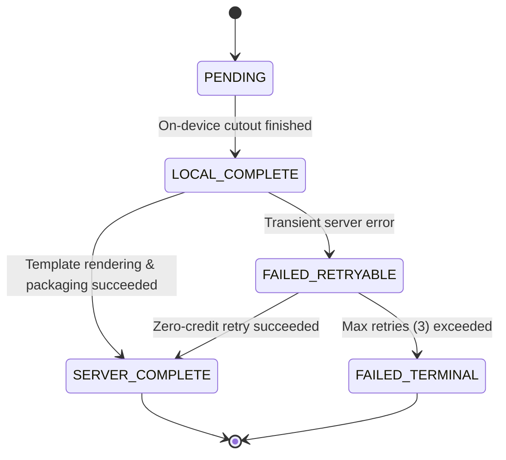

# Tora Studio — Resumable Factory Jobs & Item-Level State
**File:** `docs/ai/TORA_FACTORY_RESUMABLE_JOBS.md`  
**Version:** `1.0`  
**Status:** IMPLEMENTED & VERIFIED  

---

## 1. Problem Statement & Motivation

When executing multi-item e-commerce batches (5–25 items), transient network failures, client browser tab closures, or backend worker restarts can interrupt processing mid-way.

In a naive pipeline:
- An interruption leaves items in an indeterminate state.
- The user is forced to re-run the entire batch from item 0.
- Re-running incurs duplicate client-side inference computation (background removal / upscaling) and risks duplicate credit debits.

---

## 2. Resumable Architecture & Lifecycle States

Tora Studio introduces explicit item-level state tracking (`StudioWorkflowItem`) linked to a parent `ResumableWorkflowJob`.

### Item State Definitions:
1. `PENDING`: Initial registration; waiting for client cutout upload.
2. `LOCAL_COMPLETE`: Client-side inference finished; cutout uploaded and verified.
3. `SERVER_COMPLETE`: Server rendered all marketplace variants; variant assets stored and recorded in `variants_json`.
4. `FAILED_RETRYABLE`: Transient failure occurred during rendering or packaging; eligible for zero-credit retry.
5. `FAILED_TERMINAL`: Permanent failure (e.g. corrupted input image, unrecoverable data).
6. `CANCELLED`: User explicitly cancelled the job.

---

## 3. Worker Restart & Crash Survival

### Guaranteed Properties:
1. **Never Re-compute Completed Items**: If worker restarts while item 7 of 10 was processing, items 0 through 6 remain `SERVER_COMPLETE`. The worker resumes strictly from item 7.
2. **Never Re-charge Credits**: Wallet quota is reserved once per batch. Resumed items reference their existing item allocation; zero additional credits are deducted during restart recovery.
3. **Zip Archive Reconstitution**: Once all items reach `SERVER_COMPLETE`, the system generates the unified batch `.zip` archive referencing all cached variant outputs.
