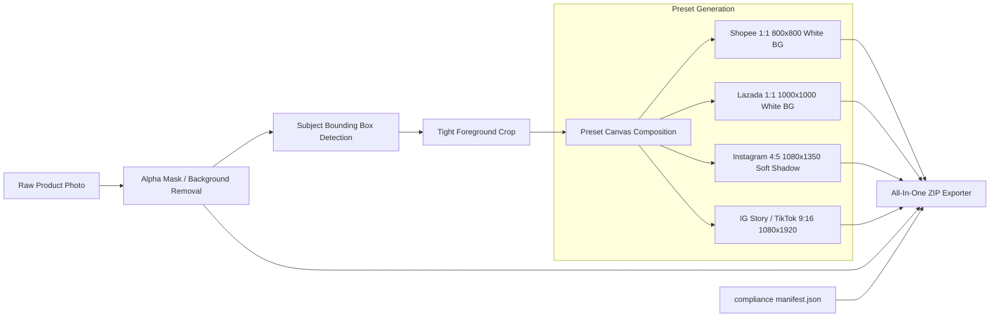

# TORA DETERMINISTIC MARKETPLACE PRODUCT PACK SPECIFICATION
**Autonomous E-Commerce Multi-Channel Asset Engine**
**Author:** Tora Studio Engineering | **Status:** IMPLEMENTED & TESTED | **Date:** 2026-10-08

---

## 1. Product Overview

The **Marketplace Product Pack** transforms raw merchant photos into high-converting, compliant e-commerce assets for major Southeast Asian and global marketplaces in a single deterministic pass.

Unlike slow, nondeterministic generative image diffusion that hallucinates incorrect product details, textures, or text logos, the Product Pack pipeline is **100% deterministic, high-speed, and artifact-free**. It preserves the exact product photography while removing noisy backgrounds, centering the product, adding soft contact shadows, and formatting for strict marketplace guidelines.

---

## 2. Pipeline Architecture

---

## 3. Marketplace Preset Specifications

| Preset Key | Marketplace / Channel | Canvas Dimensions | Aspect Ratio | Background | Padding | Output Format | Marketplace Compliance Rule |
|---|---|---|---|---|---|---|---|
| **`shopee`** | Shopee Standard Catalog | **800 × 800** | 1:1 Square | Pure White `#FFFFFF` | 10% | JPEG (Q92) | Strict white catalog requirement, prevents thumbnail rejection. |
| **`lazada`** | Lazada HD Product Listing | **1000 × 1000** | 1:1 Square | Pure White `#FFFFFF` | 10% | JPEG (Q92) | Lazada search algorithm prioritizes 1000px+ images. |
| **`instagram`** | Instagram Feed Post | **1080 × 1350** | 4:5 Portrait | Neutral `#FAFAFA` + Drop Shadow | 12% | JPEG (Q95) | Maximum mobile vertical feed screen real estate. |
| **`story`** | IG Story, Reels, TikTok | **1080 × 1920** | 9:16 Fullscreen | Studio `#F8F9FA` + Drop Shadow | 15% | JPEG (Q95) | Full vertical mobile viewing without side letterboxing. |
| **`transparent`** | Raw Cutout PNG | **Native BBox** | Dynamic | Transparent Alpha | 0% | PNG | For custom banners, flyers, and graphic design tools. |

---

## 4. Drop Shadow Physics & Algorithm

To eliminate the artificial "floating sticker" appearance common in naive background removal tools, the pipeline calculates a physical contact drop shadow beneath the product base:
1. **Center of Mass**: Located at $(c_x, c_y) = \left(\frac{x_{\min} + x_{\max}}{2}, y_{\max} + 4\right)$.
2. **Radial Extents**: $r_x = 0.42 \times \text{width}$, $r_y = \max(8.0, 0.04 \times \text{height})$.
3. **Radial Gaussian Density**:
   $$\alpha(x, y) = 90 \times \exp\left(-2.2 \times \left[\left(\frac{x - c_x}{r_x}\right)^2 + \left(\frac{y - c_y}{r_y}\right)^2\right]\right)$$
4. **Color Composition**: Blended smoothly into the white/off-white background with a peak opacity of 35% dark graphite (`#1E1E1E`), creating subtle grounding depth.

---

## 5. Pricing & Unit Economics

- **Tora Credit Cost**: 5 Tora Credits (5,000 internal quota units).
- **USD Equivalent**: \$0.010 USD.
- **Provider COGS**: \$0.000 (computed via server CPU or client browser).
- **Gross Profit Margin**: **> 98%** (net of minimal storage and bandwidth).
