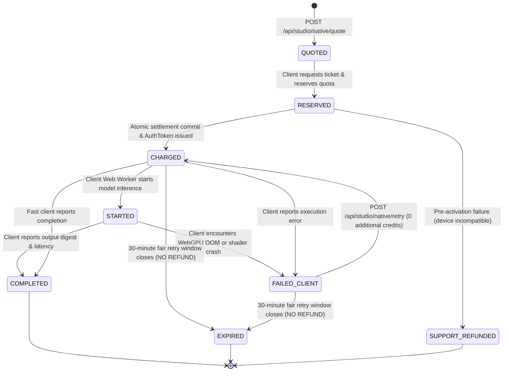

# TORA NATIVE BROWSER BILLING V2 SPECIFICATION
**Anti-Abuse Prepaid Architecture, State Machine & Fair Retry Policy**
**Author:** Tora Platform & Security Engineering | **Status:** APPROVED & TESTED | **Date:** 2026-10-08

---

## 1. Vulnerability Analysis: The V1 "Free-Use" Exploit

### The Flaw in V1:
In Queue N1-GH V1, the ticket lifecycle followed traditional cloud relay conventions:
1. Client requests ticket $\to$ Server reserves quota via `PreConsumeUserWallet`.
2. Client loads open-weight ONNX model and executes inference locally in Web Worker.
3. Client receives the processed cutout/upscaled bitmap in browser memory.
4. Client is expected to call `POST /api/studio/native/complete` to settle the reservation.
5. If `/complete` does not arrive within 300 seconds, the server background reconciliation worker sweeps the ticket and refunds the reserved quota.

### The Attack Vector:
A malicious user (or modified client script) intercepts or blocks outgoing HTTP network traffic to `/complete` after obtaining the completed result bitmap. The user saves the image locally. 5 minutes later, the server marks the ticket expired and **refunds 100% of the reserved quota**. The attacker gets continuous, unlimited AI edits for free, completely evading Tora's billing ledger.

---

## 2. The Solution: Execution-Class-Specific Billing Policies

Tora rejects a one-size-fits-all billing policy. Different execution classes have different observability:

| Execution Class | Billing Policy | Financial Settlement Trigger | Refund Policy |
|---|---|---|---|
| **`NATIVE_BROWSER`** | **`PREPAID_EXECUTION`** | **At Ticket Activation** (Before client receives execution auth token) | Pre-activation failure only; **Zero auto-refund after charge**; 30-min fair retry window for 0 credits |
| **`DETERMINISTIC_SERVER`** | **`SUCCESS_SETTLEMENT`** | **Upon Successful Generation** (Server directly observes output bytes) | 100% automatic refund on server processing failure |
| **`NATIVE_SERVER`** | **`SUCCESS_SETTLEMENT`** | **Upon Successful Generation** | 100% automatic refund on server task error |
| **`EXTERNAL_RELAY`** | **`AMBIGUOUS_RECONCILIATION`** | **Upon Provider Webhook / Polling 200 OK** | Automated reconciliation & ambiguous state resolution |

---

## 3. Ticket V2 State Machine

---

## 4. Lifecycle Protocol Details

### Step 1: Compatibility Preflight & Quote
Before asking the user to commit funds, the frontend inspects browser capabilities:
- Checks `navigator.gpu` (WebGPU) or WASM SIMD support.
- If incompatible, notifies the user or routes to server-native/relay BEFORE charging.

### Step 2: Atomic Activation & Prepaid Settlement
The client calls `POST /api/studio/native/ticket`:
1. Server verifies user has sufficient quota.
2. Server calls `model.PreConsumeUserWallet(requestId, userId, quota)`.
3. Server **immediately calls `model.SettleUserWalletPreConsume(requestId)`**.
4. Ticket status transitions directly to `CHARGED`.
5. Server sets `retry_until = now + 1800` (30 minutes).
6. Server generates an HMAC-SHA256 `auth_token` binding ticket fields.
7. Only after the financial charge is committed does the server return the execution authorization to the browser.

### Step 3: Client Execution & Completion Telemetry
- Client Web Worker executes local inference.
- On success, client calls `POST /api/studio/native/complete` with `ticket_id`, `output_asset_hash`, and `client_execution_ms`.
- Server records analytics, updates ticket to `COMPLETED`, and leaves the wallet untouched.
- If client blocks or fails to call `/complete`, the user keeps their image, and **Tora keeps the credits**. The exploit is impossible.

### Step 4: Fair Same-Ticket Retries (Sections 7 & 8)
- If the browser tab crashes, runs out of memory, or device sleeps mid-inference:
- Client calls `POST /api/studio/native/fail` $\to$ ticket marked `FAILED_CLIENT`.
- User clicks "Retry" $\to$ calls `POST /api/studio/native/retry`.
- Server validates that `now <= ticket.RetryUntil` (within 30 minutes) and issues a fresh authorization nonce.
- **Cost: Exactly 0 additional Tora Credits.**

### Step 5: Sweep & Reconciliation
`StartNativeTicketReconciliationWorker()` runs every 2 minutes:
- For `RESERVED` tickets (pre-activation failures): Quota is refunded.
- For `CHARGED`, `STARTED`, or `FAILED_CLIENT` tickets past `retry_until`: Status transitions to `EXPIRED`. **Quota is strictly NOT refunded.**
