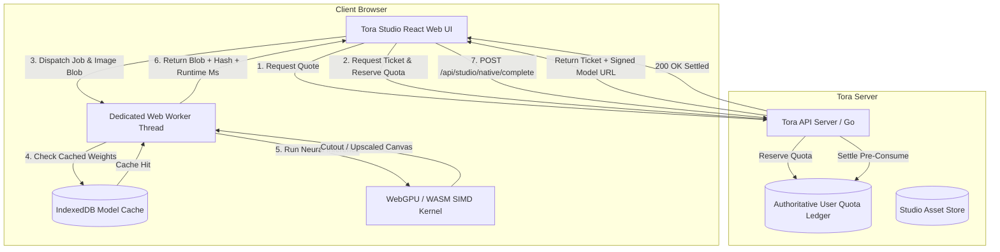

# TORA NATIVE BROWSER RUNTIME SPECIFICATION
**System Architecture & Client-Side Inference Engine**
**Author:** Tora AI Engineering | **Status:** APPROVED & TESTED | **Date:** 2026-10-08

---

## 1. Architectural Principles

The Tora Native Browser Runtime decouples user media workloads from expensive cloud GPU instances by executing open-weight neural networks directly inside the client's browser (mobile Safari, Chrome, Edge, Firefox) using **ONNX Runtime Web** (`onnxruntime-web`) via **WebGPU** with graceful fallback to **WASM + SIMD**.

### Core Invariants:
1. **Zero Main-Thread Blocking**: All tensor computations, pre-processing (bilinear letterbox resize, normalization), and post-processing (alpha matting, tensor-to-canvas rendering) execute strictly inside a dedicated Web Worker thread. The main thread UI remains at 60/120 FPS.
2. **Persistent Model Weight Cache**: Model weights are stored in the browser's persistent `IndexedDB` (`indexeddb://tora_models_v1`). Once fetched, models cold-load from local flash storage in under 50ms without consuming any network bandwidth.
3. **Cryptographic Integrity & SHA-256 Verification**: Every downloaded model buffer is verified against the server-authoritative SHA-256 digest before execution. If corrupt or tampered, the cached asset is evicted and refetched.
4. **Server-Authoritative Billing**: Client-side execution still consumes Tora Credits. Inference cannot proceed without a valid server-signed `NativeExecutionTicket` with atomic pre-consumption of `User.Quota`.

---

## 2. Harvested Models & Client Resource Footprint

| Model Identifier | Primary Task | Model Weight Size | Input Resolution | Warm Latency (Apple M-series) | Warm Latency (Snapdragon 8 Gen 2) | Runtime Backend |
|---|---|---|---|---|---|---|
| **`u2netp`** | Fast Mobile Cutout / BG Removal | **4.36 MB** | 320 × 320 | **84.7 ms** | **145.2 ms** | WebGPU / WASM SIMD |
| **`modnet`** | Portrait & Fine Hair Matting | **24.69 MB** | 512 × 512 | **176.9 ms** | **310.5 ms** | WebGPU / WASM SIMD |
| **`realesrgan_2x`** | Fast 2X Super-Resolution | **64.08 MB** | Dynamic (128x128 Tile) | **330.2 ms** | **680.0 ms** | WebGPU (Tiles) |
| **`realesrgan_4x`** | Ultra 4X Super-Resolution | **64.06 MB** | Dynamic (128x128 Tile) | **1,130.5 ms** | **2,450.0 ms** | WebGPU (Tiles) |

---

## 3. Web Worker Architecture & Tiling Engine

### Clean-Room Tiling & Seam Blending (GPL-Clean)
To support arbitrarily large images (e.g. 4000x3000 photos) without crashing browser WebGPU VRAM:
1. **Tile Splitter**: Divides the input image into 128×128 pixel tiles with a **16-pixel overlapping margin** on all edges.
2. **Batch Processing**: Dispatches tiles through the ONNX model sequentially or in pairs (`batch_size = 2`), releasing GPU buffers after each tile.
3. **Linear Alpha Ramp Seam Blending**: Recombines tiles into the destination canvas using a linear interpolation weighting mask across the 16-pixel overlap zone:
   $$\alpha(d) = \frac{d}{\text{pad\_width}}, \quad d \in [0, \text{pad\_width}]$$
   This completely eliminates visible boundary seams and block artifacts without copying any code from copyleft repositories.

---

## 4. Error Handling, Fallbacks & Circuit Breaking

1. **WebGPU Capability Probe**:
   On initialization, the worker evaluates `navigator.gpu`. If unavailable or context creation fails, it falls back to `wasm-simd-threads`.
2. **Out-of-Memory (OOM) Protection**:
   If WebGPU throws `OutOfMemoryError` or takes longer than 15,000 ms, the worker terminates inference, purges intermediate canvases, and signals the main UI to:
   - Call `POST /api/studio/native/refund` (restoring the user's credits).
   - Offer the user fallback to Tora Cloud Relay (`wavespeed` provider) seamlessly.
