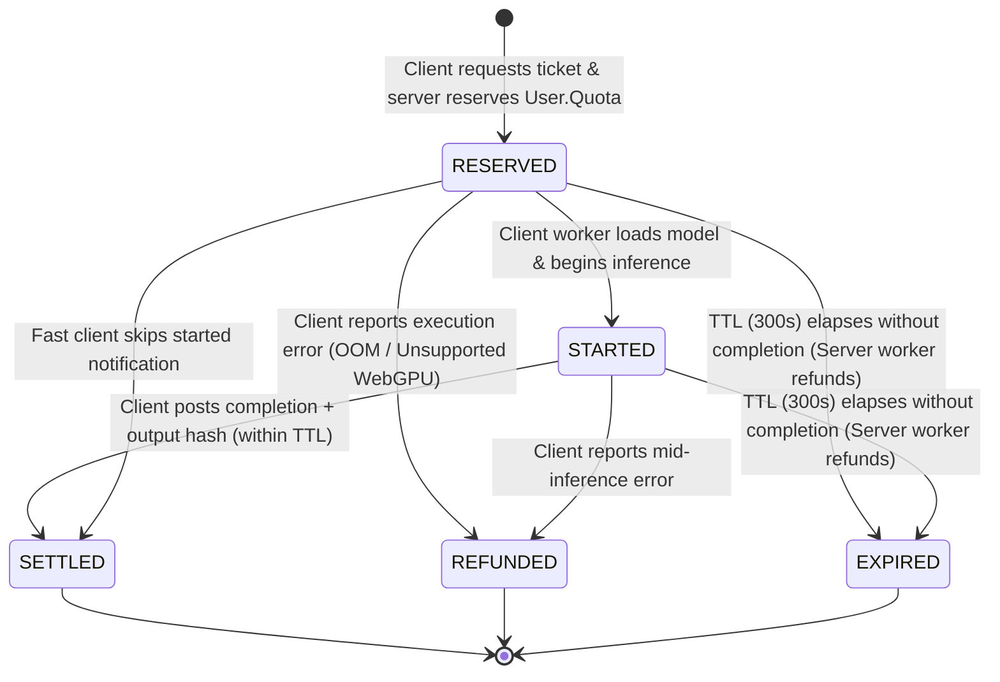

# TORA NATIVE EXECUTION TICKET PROTOCOL SPECIFICATION
**Cryptographic & Financial Protocol for Client-Side AI Billing**
**Author:** Tora AI Platform Team | **Status:** IMPLEMENTED & VERIFIED | **Date:** 2026-10-08

---

## 1. Motivation & Problem Statement

Running inference in the user's browser reduces server infrastructure costs (COGS) to near zero. However, client-side inference introduces serious economic and security vulnerabilities:
1. **The Piracy Problem**: If model weights and execution logic reside entirely on the client, users could modify client JavaScript to run unlimited free inference without paying Tora Credits.
2. **The Abandonment Problem**: If a user initiates an inference job, reserves quota, but closes the browser tab before completion, quota could become permanently stuck in escrow.
3. **The Replay Attack Problem**: An attacker could replay a single completion payload multiple times or submit invalid completion hashes to evade billing.

The **Native Execution Ticket Protocol** solves all three problems by enforcing strict server-authoritative wallet reservations, cryptographically tied tickets, and automated time-to-live (TTL) expiration sweeps.

---

## 2. Protocol State Machine



---

## 3. Ticket Data Contract (`model.NativeExecutionTicket`)

```go
type NativeExecutionTicket struct {
    Id                  string               // "tkt_1728374900_a1b2c3d4"
    TicketId            string               // Unique ticket identifier
    UserId              int                  // Binds to authenticated User.Id
    ToolId              string               // "background-remove", "image-upscale-2x", "product-pack"
    ToolVersion         string               // "v1.0.0"
    RouteVersion        string               // "v1_native_u2netp"
    ExecutionClass      NativeExecutionClass // NATIVE_BROWSER, NATIVE_LOCAL_CPU, DETERMINISTIC_PROCESSING
    ModelVersionHash    string               // SHA256 of authorized ONNX weight file
    QuoteId             string               // Signed server quote ID
    RequestId           string               // Binds to WalletPreConsumeRecord
    ReservedQuota       int                  // Exact internal quota deducted (e.g. 2,000 quota)
    ReservedCredits     int                  // User-facing credits (e.g. 2 Tora Credits)
    NormalizedInputHash string               // SHA256 of normalized input parameters
    Status              NativeTicketStatus   // RESERVED, STARTED, COMPLETED, SETTLED, REFUNDED, EXPIRED
    IssuedAt            int64                // Unix epoch timestamp
    ExpiresAt           int64                // IssuedAt + 300 seconds
    CompletedAt         int64                // When client finished inference
    SettledAt           int64                // When wallet reservation was settled
    RefundedAt          int64                // When wallet reservation was restored
    ClientExecutionMs   int64                // Reported execution latency in milliseconds
    ClientDeviceClass   string               // e.g. "iphone_safari_webgpu", "chrome_desktop_webgpu"
    OutputAssetHash     string               // SHA256 digest of client generated result
    ErrorReason         string               // Failure reason if refunded
}
```

---

## 4. REST API Endpoints

### 1. `POST /api/studio/native/quote` (Public)
Calculates current native tool pricing, returns authorized model digests and execution class.
```json
{
  "tool_id": "background-remove",
  "execution_class": "NATIVE_BROWSER"
}
```
**Response (200 OK):**
```json
{
  "success": true,
  "data": {
    "quote_id": "qte_native_1728374900_e7b9f1a2",
    "tool_id": "background-remove",
    "execution_class": "NATIVE_BROWSER",
    "credits": 2,
    "quota": 2000,
    "usd_equivalent": 0.0040,
    "model": {
      "model_id": "u2netp",
      "model_name": "U2Net-P Fast Mobile Cutout",
      "sha256": "309c8469258dda742793dce0ebea8e6dd393174f89934733ecc8b14c76f4ddd8",
      "size_bytes": 4572242,
      "format": "onnx",
      "license": "Apache-2.0"
    },
    "route_version": "v1_native_u2netp",
    "expires_at": 1728375200,
    "fallback_provider": "wavespeed"
  }
}
```

### 2. `POST /api/studio/native/ticket` (Authenticated)
Deducts quota atomically via `model.PreConsumeUserWallet` and issues the execution ticket.
```json
{
  "tool_id": "background-remove",
  "execution_class": "NATIVE_BROWSER",
  "inputs": { "width": 512, "height": 512 },
  "client_device_class": "mac_safari_webgpu"
}
```

### 3. `POST /api/studio/native/complete` (Authenticated)
Settles the reservation permanently. Idempotent against network retries.
```json
{
  "ticket_id": "tkt_1728374900_a1b2c3d4",
  "output_asset_hash": "e3b0c44298fc1c149afbf4c8996fb92427ae41e4649b934ca495991b7852b855",
  "client_execution_ms": 84,
  "client_device_class": "mac_safari_webgpu"
}
```

### 4. `POST /api/studio/native/refund` (Authenticated)
Rolls back the reservation if the client encounters an error or cancels.
```json
{
  "ticket_id": "tkt_1728374900_a1b2c3d4",
  "reason": "WebGPU out of memory"
}
```

---

## 5. Automated Reconciliation Sweep

The server runs `StartNativeTicketReconciliationWorker()` every 2 minutes. Any tickets in `RESERVED` or `STARTED` state whose `ExpiresAt` has passed are automatically refunded to the user's `Quota` balance and transitioned to `EXPIRED`. Zero user credits are lost to abandoned browser sessions.
