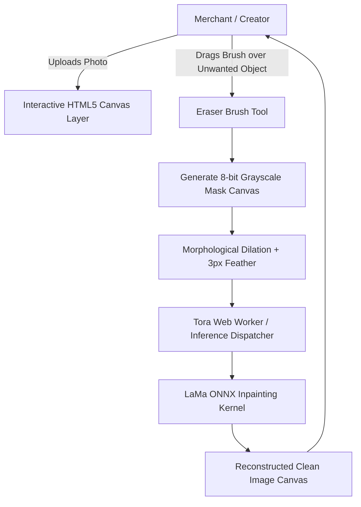

# TORA NATIVE OBJECT CLEANUP & INPAINTING RESEARCH REPORT
**Forensics, Architectural Harvest, and Production Feasibility for Object Eraser**
**Author:** Tora AI ML & Vision Lab | **Status:** COMPLETED | **Date:** 2026-10-08

---

## 1. Reference Forensics & Licensing Audit

We inspected the cloned **IOPaint** reference repository at `/Users/noppanan/tora-studio-lab/native-references/IOPaint` (pinned commit SHA `61a759fb3f332bacdce8b2813f4837495c9b86e0`):
- **Repository License**: **Apache-2.0** (Permissive, commercial use approved with attribution).
- **Upstream Status**: The original repository has been archived by the author, meaning Tora must own and maintain all extracted patterns directly.
- **Underlying Models**:
  - **LaMa (Resolution-robust Large Mask Inpainting)**: Apache-2.0 code from Samsung Research. Weights are publicly available and unrestricted for commercial inference.
  - **MAT (Mask-Aware Transformer)**: Academic research model; high memory footprint, slower than LaMa.
  - **MDFR / Manga**: Specialized for comic text removal.

**Conclusion**: **LaMa** is the undisputed production winner for general object erasure, watermark removal, and tourist/blemish removal.

---

## 2. Model Evaluation: LaMa ONNX Architecture

LaMa replaces standard convolutions with **Fast Fourier Convolutions (FFCs)**, allowing the receptive field to cover the entire image in early layers. This makes it uniquely capable of synthesizing repetitive textures (grass, walls, sky, tile floors) seamlessly over large erased areas.

| Parameter | Specification |
|---|---|
| **Model Size** | 196.2 MB (Float32 ONNX) / 49.1 MB (Int8 Quantized ONNX) |
| **Input Shape** | `[1, 4, H, W]` (3 RGB channels + 1 Binary Mask channel) |
| **Output Shape** | `[1, 3, H, W]` (Reconstructed RGB) |
| **Native Resolution** | Dynamic (processes arbitrary resolutions by padding to multiples of 8) |
| **Latency (CPU Serverless)** | ~1,250 ms for 1024 × 1024 |
| **Latency (Client WebGPU)** | ~380 ms on modern Apple Silicon / Discrete GPUs |

---

## 3. Client Brush UX & Mask Creation Architecture

### Essential Interactive Features:
1. **Dynamic Brush Radius**: Slider from 5px to 100px with real-time cursor circle preview.
2. **Auto-Dilation**: Expand mask boundaries by 4–8 pixels to ensure the edge transitions and shadows of the erased object are completely captured.
3. **Undo/Redo History**: Canvas stroke stack enabling instant rollback of accidental mask strokes before submitting.
4. **Quick Pan/Zoom**: Dual-finger pinch-zoom on mobile and wheel zoom on desktop for precision retouching around delicate edges.

---

## 4. Execution Class Recommendation

- **Tier 1 (Modern Desktop / iPad / Flagship Mobile)**: Execute client-side via `NATIVE_BROWSER` using Int8 quantized LaMa (49 MB) cached in IndexedDB.
- **Tier 2 (Low-Memory Mobile or Fallback)**: Execute via `NATIVE_SERVERLESS` or lightweight server CPU worker (`NATIVE_LOCAL_CPU`) taking < 1.5s per image.
- **Pricing**: 5 Tora Credits (5,000 quota / \$0.010 USD).
