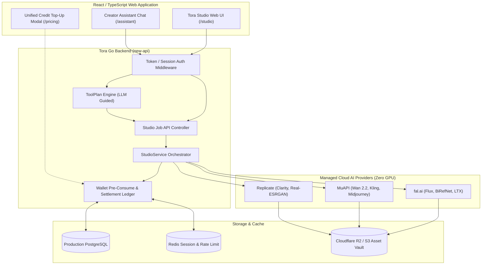

# TORA AI STUDIO — SYSTEM ARCHITECTURE, UX & SECURITY PLAN
## UNIFIED PLATFORM DESIGN, CREATOR ASSISTANT & ZERO-GPU PRODUCTION TOPOLOGY

> **Platform Anchor**: Tora AI Core Platform (`https://www.toraapi.com`)  
> **Infrastructure Invariant (Section 45)**: `NEW_SERVER_COUNT = 0`, `NEW_GPU_SERVER_COUNT = 0`.  
> **Commercial Mission (Section 27)**: Drive purchase and consumption of unified Tora Credits across Chat, Image, Video, and Creator workflows with a single wallet.

---

### 1. High-Level System Architecture

---

### 2. Product Conversion UX (Section 38)

The Studio user interface is explicitly engineered around friction-free conversion into Tora Credits:

1. **Tool Selection**: User navigates to `/studio` and chooses a workflow (e.g. *Product Photo Studio* or *Video Generate*).
2. **Preset Template / Upload**: User drags and drops source media or selects a curated preset prompt template.
3. **Credit Estimation**: The interface dynamically calculates the cost in **Tora Credits** (e.g. *"50 Credits (≈ ฿3.50)"*) and displays the user's live balance.
4. **Insufficient Balance Experience**:
   - If user balance < tool cost:
   - The primary button transitions to **"เติมเครดิตเพื่อสร้างงาน (Top up Credits)"**.
   - Clicking opens the Stripe/PromptPay modal while **preserving all uploaded assets, prompt text, and selected parameters in local state**.
   - Upon successful payment callback, the modal closes and the job immediately resumes without requiring re-upload.
5. **Real-Time Job Telemetry**: Progress bar animates via SSE/polling, displaying live state (`queued` -> `processing` -> `completed`).

---

### 3. Creator Assistant Orchestration (`/assistant`) (Section 39)

The Creator Assistant provides a conversational prompt-to-production interface:
- **User Prompt**: *"ช่วยนำรูปสินค้าขวดเซรั่มนี้ ลบพื้นหลัง แล้วสร้างเป็นรูปโฆษณาบนโต๊ะหินอ่อนพร้อมแสงแดด แล้วทำวิดีโอ 5 วินาทีสำหรับลง TikTok"*
- **Architectural Safeguard**: The LLM is **NEVER** permitted to invoke external media providers directly.
- **Workflow Decomposition (ToolPlan)**:
  1. Step 1: `background_remove` (Input: `user_asset_1.png`) -> Output: `clean_product.png` (Cost: 10 Credits)
  2. Step 2: `product_photo_studio` (Input: `clean_product.png`, Prompt: *"Luxury marble table with soft morning sunlight"*, AspectRatio: *"4:5"*) -> Output: `ad_photo.png` (Cost: 50 Credits)
  3. Step 3: `video_generate_pro` (Input: `ad_photo.png`, Prompt: *"Subtle camera pan, soft light shimmering on serum bottle"*, Duration: *"5s"*) -> Output: `tiktok_ad.mp4` (Cost: 125 Credits)
- **Total Estimated Quota**: 185 Credits.
- **User Confirmation Gate**: The assistant renders an interactive approval card displaying the 3-step pipeline, estimated duration (~60s), and total credit cost before dispatching the jobs to `StudioService`.

---

### 4. Database Schema Proposal (Section 41)

All Studio tables are strictly additive and reside within the existing PostgreSQL database:

1. `studio_tool_definitions`: Master metadata, active status, and quota pricing.
2. `studio_tool_templates`: Curated community and system prompts, aspect ratio presets.
3. `studio_tool_provider_routes`: Primary/fallback provider routing rules, health status, and latency metrics.
4. `studio_tool_jobs`: Core execution records, idempotency keys, and billing ledger linkage (`request_id`).
5. `studio_job_events`: Immutable audit trail of state transitions (`created`, `reserved`, `submitted`, `settled`, `refunded`).
6. `studio_assets`: User media files stored in Cloudflare R2 / S3 (file size, MIME type, hash, expiry TTL).
7. `studio_cost_snapshots`: Historic provider COGS tracking for margin analytics.

---

### 5. Production Security & Compliance Safeguards (Section 44)

| Risk Category | Threat Vector | Technical Mitigation Safeguard |
| :--- | :--- | :--- |
| **Media Uploads** | Malicious executable upload, polyglot files | Strict MIME type validation via **magic bytes inspection** (not file extension). Maximum payload cap: 50MB (images) / 200MB (video). |
| **SSRF / Webhooks** | Attacker submitting internal IP webhooks (`169.254.169.254`, `localhost`) | Strict egress IP validation: reject RFC 1918 private subnets and AWS metadata endpoints. Webhook validation requires HMAC SHA-256 header signatures. |
| **Asset Storage** | Direct public bucket exposure | All client uploads utilize **short-lived presigned URLs** (15-minute TTL) with restricted `PUT` permissions. Assets served via Cloudflare CDN edge cache. |
| **IDOR / Data Isolation**| User probing job IDs of other accounts | Job endpoints strictly filter by authenticated `user_id` from JWT session. UUIDv4 job identifiers prevent enumeration attacks. |
| **Biometric Likeness** | Unauthorized deepfakes or impersonation | Face swap and lip sync tools enforce an immutable user agreement checkbox and digital watermarking in accordance with international AI safety standards. |
| **Double Spending** | Concurrent rapid clicks on generate button | Strict cryptographic `idempotency_key` deduplication in Redis and PostgreSQL unique indexes. |
