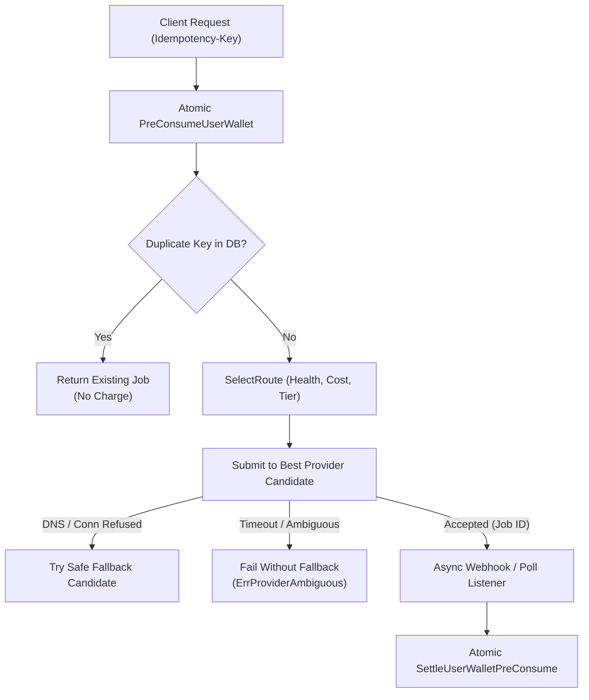

# TORA AI STUDIO — API PROVIDER MATRIX
## MULTI-PROVIDER EVALUATION: WaveSpeedAI vs KIE.ai vs FAL.AI vs REPLICATE vs RUNWARE

> **Target Platform**: Tora Studio Media AI Suite  
> **Architecture**: Generic Media Relay Core (Zero GPU on current EC2)  
> **Key Integration Rule**: Never hard-code API keys in documentation or code. Use environment variables and provider key vault.  
> **Last Updated**: 2026-10-07 (Queue 2F Generic Relay Core Integration)

---

### 1. Provider Comparison Overview

| Provider | Base URL | Auth Header Format | Request Model / Protocol | Webhook Support | Dynamic Quoting | Key Strengths / Role |
| :--- | :--- | :--- | :--- | :--- | :--- | :--- |
| **WaveSpeedAI** | `https://api.wavespeed.ai` | `Authorization: Bearer <KEY>` | `WAVESPEED_V3` (`/api/v3/media/*`) | Webhook & Polling | `/api/v3/model/price` endpoint | Lowest COGS, dynamic discounted pricing, Flux Schnell/Dev, BiRefNet |
| **KIE.ai** | `https://api.kie.ai` | `Authorization: Bearer <KEY>` | `KIE_JOBS_V1` (`/api/v1/jobs/*`) | Webhook (`callBackUrl`) & Polling | Catalog flat rate | High reliability, clean task IDs, Ideogram V2, rembg, upscale |
| **fal.ai** | `https://queue.fal.run` | `Authorization: Key <KEY>` | `FAL_QUEUE_V1` (`/{model_id}`) | Native (`?fal_webhook=`) & SSE | Pre-quoted model rates | Industry standard, low latency, currently BILLING_BLOCKED |
| **Replicate** | `https://api.replicate.com` | `Authorization: Bearer <TOKEN>` | `REPLICATE_PREDICTIONS_V1` | Native (`webhook` field) & Polling | Fixed runtime rates | Vast open-source library, secondary fallback |
| **Runware** | `https://api.runware.ai` | `Authorization: Bearer <KEY>` | WebSocket Multiplexed / REST | Native stream | Flat per-image rates | Ultra-fast FLUX inference; future evaluation |

---

### 2. WaveSpeedAI Protocol Specification (`WAVESPEED_V3`)

- **Authentication**: `Authorization: Bearer ${WAVESPEED_API_KEY}`
- **Dynamic Pricing Endpoint**: `POST /api/v3/model/price`
  - Query contains `model_id` and parameters (e.g. resolution, steps).
  - Returns `base_price` and `discounted_price`.
  - Tora caches quotes for 5 minutes (`MediaPriceCache`) and bases retail margin strictly on `discounted_price`.
- **Submit Task**: `POST /api/v3/media/tasks`
  - Body contains normalized parameters and `webhook_url`.
  - Returns `{"task_id": "ws_..."}`.
- **Polling & Webhook**: `GET /api/v3/media/tasks/{id}`, `POST /api/studio/webhook/wavespeed`.

---

### 3. KIE.ai Protocol Specification (`KIE_JOBS_V1`)

- **Authentication**: `Authorization: Bearer ${KIE_API_KEY}`
- **Submit Task**: `POST /api/v1/jobs/createTask`
  - Body contains `model`, `callBackUrl`, and `params`.
  - Returns `{"code": 200, "data": {"taskId": "kie_..."}}`.
- **Status & Polling**: `GET /api/v1/jobs/recordInfo?taskId={id}`
  - Returns state (`waiting`, `running`, `success`, `fail`), `result.images`, and cost.
- **Webhook Endpoint**: `POST /api/studio/webhook/kie`

---

### 4. fal.ai Queue Protocol Specification (`FAL_QUEUE_V1`)

- **Authentication**: `Authorization: Key ${FAL_KEY}`
- **Submit Request**: `POST https://queue.fal.run/{model_id}?fal_webhook=...`
- **Current Operational Status**: `AUTHENTICATED` / `BILLING_BLOCKED` (Exhausted balance HTTP 403 on upstream test). Kept as an active protocol adapter ready for top-up.

---

### 5. Multi-Provider Logical Tool Routing Matrix

| Logical Tool | Tier | WaveSpeed Route | KIE Route | fal.ai Route | Replicate Route |
| :--- | :---: | :--- | :--- | :--- | :--- |
| **Background Remove** | `FAST` | `wavespeed-ai/birefnet` ($0.004) | `rembg` ($0.005) | `fal-ai/birefnet` ($0.005) | `cjwbw/rembg` |
| **Image Upscale (4K)** | `QUALITY` | `wavespeed-ai/image-upscaler` ($0.010)| `upscale-v1` ($0.012) | `fal-ai/clarity-upscaler` ($0.015)| `nightmareai/real-esrgan` |
| **Image Generate (Fast)**| `FAST` | `wavespeed-ai/flux-schnell` ($0.0025)| `flux-schnell` ($0.003) | `fal-ai/flux/schnell` ($0.003) | `black-forest-labs/flux-schnell` |
| **Image Generate (Pro)** | `QUALITY` | `wavespeed-ai/flux-dev` ($0.018) | `flux-dev` ($0.020) | `fal-ai/flux/dev` ($0.025) | `black-forest-labs/flux-dev` |
| **Product Photo Studio** | `PREMIUM` | `wavespeed-ai/product-photo` ($0.025)| — | `fal-ai/product-photography` ($0.035)| — |

---

### 6. Runware Protocol Architectural Evaluation Note

Runware (`https://api.runware.ai`) was reviewed as a potential high-throughput candidate:
1. **Connection Model**: Runware relies primarily on persistent WebSocket connections (`wss://ws-api.runware.ai/v1`) with message multiplexing, though a REST fallback exists.
2. **Advantages**:
   - Ultra-low connection handshake overhead for high-concurrency batch operations.
   - Per-image generation times down to ~300ms for distilled models.
3. **Operational Overhead for Tora**:
   - WebSocket connection pooling in Go requires maintaining stateful connection pools across multiple app server instances.
   - Tora's current architecture is stateless HTTP/REST with webhook callbacks and Redis-backed state, keeping `NEW_SERVER_COUNT = 0`.
4. **Integration Roadmap**:
   - Scheduled for evaluation in a future phase once WaveSpeed and KIE live volumes demonstrate saturation or latency bottlenecks.

---

### 7. Idempotency & Safe-Fallback Invariants

