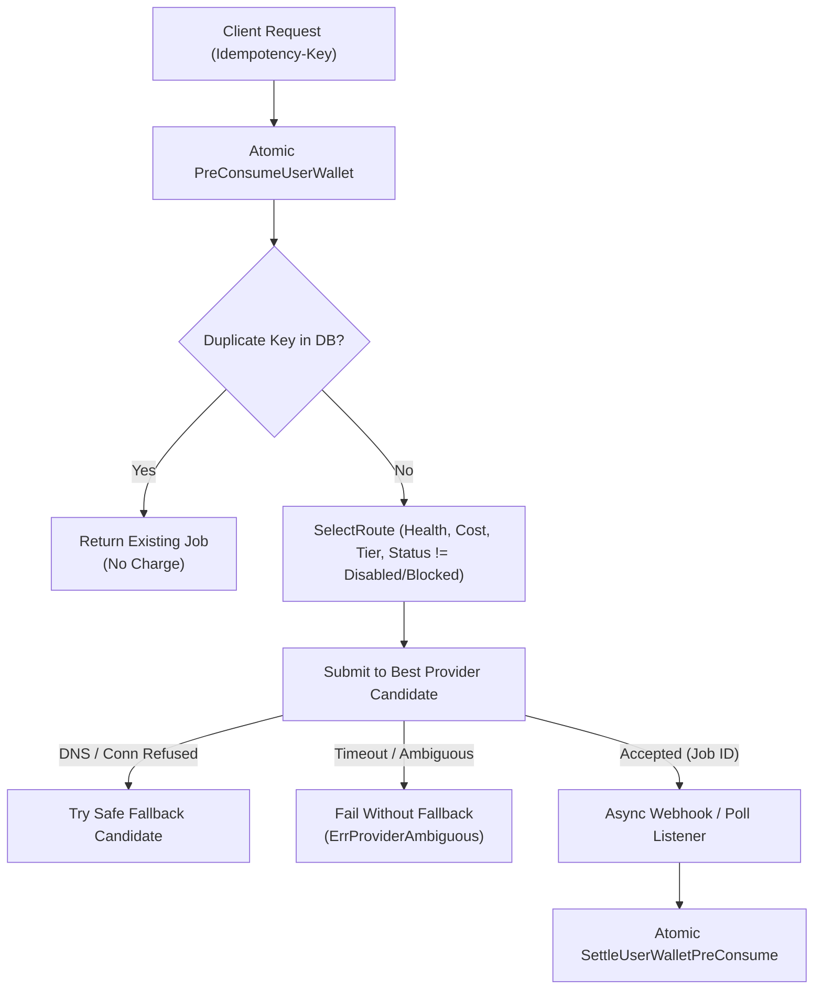

# TORA AI STUDIO — API PROVIDER MATRIX
## MULTI-PROVIDER EVALUATION: WaveSpeedAI vs KIE.ai vs FAL.AI vs REPLICATE vs RUNWARE
### Queue 2G: Reconciled Provider Contracts, Canonical Pricing & Price Governance

> **Target Platform**: Tora Studio Media AI Suite  
> **Architecture**: Generic Media Relay Core (Zero GPU on current EC2)  
> **Security Rule**: Never hard-code API keys in documentation or code. Use environment variables and provider key vault.  
> **Authoritative Invariants**:
> - ONE USER, ONE TORA WALLET, ONE BILLING LEDGER (`User.Quota` only)
> - Conversion: $1.00 USD = 500,000 Quota = 500 Tora Credits (1 Credit = 1,000 Quota = $0.0020 USD)
> - Margin Floor $\ge 60\%$ strictly enforced by server router  
> **Last Updated**: 2026-10-07 (Queue 2G Contract Reconciliation & Billing Canonicalization)

---

### 1. Provider Comparison Overview

| Provider | Base URL | Auth Header Format | Request Model / Protocol | Webhook Support | Dynamic Quoting | Key Strengths / Role |
| :--- | :--- | :--- | :--- | :--- | :--- | :--- |
| **WaveSpeedAI** | `https://api.wavespeed.ai` | `Authorization: Bearer <KEY>` | `WAVESPEED_V3` (`/api/v3/{model_id}`) | Polling & Webhook | `POST /api/v3/model/price` | Lowest COGS, dynamic discounted pricing, Flux Schnell/Dev, BiRefNet |
| **KIE.ai** | `https://api.kie.ai` | `Authorization: Bearer <KEY>` | `KIE_JOBS_V1` (`/api/v1/jobs/createTask`) | Webhook (`callBackUrl`) & Polling | Flat rate / Market catalog | High reliability, clean task IDs, rembg, upscale, Flux |
| **fal.ai** | `https://queue.fal.run` | `Authorization: Key <KEY>` | `FAL_QUEUE_V1` (`/{model_id}`) | Native (`?fal_webhook=`) & SSE | Pre-quoted model rates | Industry standard, low latency; currently `BILLING_BLOCKED` |
| **Replicate** | `https://api.replicate.com` | `Authorization: Bearer <TOKEN>` | `REPLICATE_PREDICTIONS_V1` | Native (`webhook` field) & Polling | Fixed runtime rates | Vast open-source library, secondary fallback |
| **Runware** | `https://api.runware.ai` | `Authorization: Bearer <KEY>` | WebSocket Multiplexed / REST | Native stream | Flat per-image rates | Ultra-fast FLUX inference; future evaluation |

---

### 2. WaveSpeedAI Protocol Specification (`WAVESPEED_V3`)

- **Base URL**: `https://api.wavespeed.ai/api/v3`
- **Authentication**: `Authorization: Bearer ${WAVESPEED_API_KEY}`
- **Execution Endpoint**: `POST https://api.wavespeed.ai/api/v3/{model_id}`
  - Example: `POST https://api.wavespeed.ai/api/v3/wavespeed-ai/birefnet`
  - Body contains input parameters (e.g. `{"image_url": "..."}`).
  - Returns `{"code": 200, "data": {"id": "pred_...", "status": "processing"}}`.
- **Polling Endpoint**: `GET https://api.wavespeed.ai/api/v3/predictions/{id}/result`
  - Returns status (`starting`, `processing`, `succeeded`, `failed`) and outputs array (`data.outputs`).
- **Dynamic Pricing Endpoint**: `POST https://api.wavespeed.ai/api/v3/model/price`
  - Body: `{"model": "{model_id}", ...}`
  - Returns: `{"code": 200, "data": {"base_price": 0.005, "discounted_price": 0.0035, "currency": "USD"}}`.
  - Tora caches quotes for 5 minutes (`MediaPriceCache`) and bases retail margin strictly on `discounted_price`.
- **Model Catalog Endpoint**: `GET https://api.wavespeed.ai/api/v3/models`
- **Webhook Endpoint**: `POST /api/studio/webhook/wavespeed`

*(Note: The string `/api/v3/media/tasks` in preliminary Queue 2F notes was a documentation erratum; the production Go code in `service/studio_wavespeed.go` targets `fmt.Sprintf("%s/%s", baseURL, modelID)`).*

---

### 3. KIE.ai Protocol Specification (`KIE_JOBS_V1`)

- **Base URL**: `https://api.kie.ai`
- **Authentication**: `Authorization: Bearer ${KIE_API_KEY}`
- **Submit Task**: `POST https://api.kie.ai/api/v1/jobs/createTask`
  - Body schema:
    ```json
    {
      "model": "rembg",
      "input": {
        "image_url": "https://..."
      },
      "callBackUrl": "https://www.toraapi.com/api/studio/webhook/kie"
    }
    ```
  - Response: `{"code": 200, "data": {"taskId": "kie_task_abc123"}}`.
- **Status & Polling Endpoint**: `GET https://api.kie.ai/api/v1/jobs/recordInfo?taskId={id}`
  - Returns status (`waiting`, `running`, `success`, `fail`), `result.images`, and cost.
- **Webhook Endpoint**: `POST /api/studio/webhook/kie`

---

### 4. fal.ai Queue Protocol Specification (`FAL_QUEUE_V1`)

- **Authentication**: `Authorization: Key ${FAL_KEY}`
- **Submit Request**: `POST https://queue.fal.run/{model_id}?fal_webhook=...`
- **Current Operational Status**: `AUTHENTICATED` / `BILLING_BLOCKED` (Exhausted balance HTTP 403). Retained as an active adapter ready to resume immediately upon top-up.

---

### 5. Multi-Provider Logical Tool Routing Matrix (Canonical)

| Logical Tool | Tier | WaveSpeed Route (`WAVESPEED_V3`) | KIE Route (`KIE_JOBS_V1`) | fal.ai Route (`FAL_QUEUE_V1`) | Replicate Route |
| :--- | :---: | :--- | :--- | :--- | :--- |
| **Background Remove** | `FAST` | `wavespeed-ai/birefnet` ($0.0040) | `rembg` ($0.0050) | `fal-ai/birefnet` ($0.0050) | `cjwbw/rembg` |
| **Image Upscale (4K)** | `QUALITY` | `wavespeed-ai/image-upscaler` ($0.0100) | `upscale-v1` ($0.0120) | `fal-ai/clarity-upscaler` ($0.0150) | `nightmareai/real-esrgan` |
| **Image Generate (Fast)**| `FAST` | `wavespeed-ai/flux-schnell` ($0.0025) | `flux-schnell` ($0.0030) | `fal-ai/flux/schnell` ($0.0030) | `black-forest-labs/flux-schnell` |
| **Image Generate (Pro)** | `QUALITY` | `wavespeed-ai/flux-dev` ($0.0180) | `flux-dev` ($0.0200) | `fal-ai/flux/dev` ($0.0250) | `black-forest-labs/flux-dev` |
| **Product Photo Studio** | `QUALITY` | `wavespeed-ai/flux-dev` ($0.0180) | `flux-dev` ($0.0200) | `fal-ai/product-photography` ($0.0350) | — |

---

### 6. Runware Protocol Architectural Evaluation Note

Runware (`https://api.runware.ai`) was reviewed as a potential high-throughput candidate:
1. **Connection Model**: Runware relies primarily on persistent WebSocket connections (`wss://ws-api.runware.ai/v1`) with message multiplexing, though a REST fallback exists.
2. **Advantages**: Ultra-low connection handshake overhead for high-concurrency batch operations; per-image generation times down to ~300ms for distilled models.
3. **Operational Overhead for Tora**:
   - WebSocket connection pooling in Go requires maintaining stateful connection pools across multiple app server instances.
   - Tora's current architecture is stateless HTTP/REST with webhook callbacks and Redis-backed state, keeping `NEW_SERVER_COUNT = 0`.
4. **Integration Roadmap**: Scheduled for evaluation in a future phase once WaveSpeed and KIE live volumes demonstrate saturation or latency bottlenecks.

---

### 7. Idempotency & Safe-Fallback Invariants


