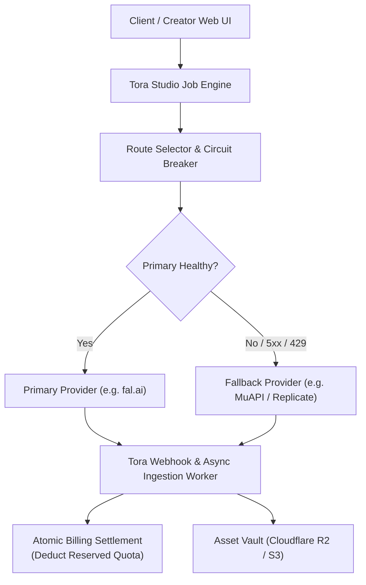

# TORA AI STUDIO — API PROVIDER MATRIX
## MULTI-PROVIDER EVALUATION: MuAPI vs FAL.AI vs REPLICATE

> **Target Platform**: Tora Studio Media AI Suite  
> **Architecture**: Provider-Agnostic Media Gateway (Zero GPU on current EC2)  
> **Key Integration Rule**: Never hard-code API keys in documentation or code. Use environment variables and provider key vault.

---

### 1. Provider Comparison Overview

| Provider | Base URL | Auth Header Format | Request Model | Webhook Support | Cost Tracking | Key Strengths |
| :--- | :--- | :--- | :--- | :--- | :--- | :--- |
| **MuAPI** | `https://api.muapi.ai` | `x-api-key: <KEY>` | Submit-then-Poll (`/api/v1/predictions/{id}`) | Webhook & Polling | `X-MuAPI-Cost-USD` Header | Aggregates Midjourney V7, Kling, Suno, Wan 2.1/2.2 under unified API |
| **fal.ai** | `https://queue.fal.run` | `Authorization: Key <KEY>` | Async Queue (`/status`) + WebSockets | Native (`x-fal-webhook-url`) | Per-second / per-request ledger | Lowest latency, cutting-edge Flux/LTX/Wan endpoints, high throughput |
| **Replicate** | `https://api.replicate.com` | `Authorization: Bearer <TOKEN>` | Submit-then-Poll (`/v1/predictions/{id}`) | Native (`webhook` field) | Exact per-second billing | Vast model library, battle-tested production SLA, open-source models |

---

### 2. Comprehensive 15-Tool Provider Routing Matrix

| # | Logical Studio Tool | Primary Candidate | Fallback Candidate | Provider Cost Est. (USD) | Execution Latency | Primary Endpoint / Model ID | Webhook? | Safety / Consent Requirements |
| :-: | :--- | :--- | :--- | :---: | :---: | :--- | :---: | :--- |
| 1 | **Image Generate (Fast)** | **fal.ai** | **Replicate** | $0.003 / image | ~1.2s | `fal-ai/flux/schnell` | Yes | Standard NSFW filter |
| 2 | **Image Generate (Pro)** | **fal.ai** | **MuAPI** | $0.025 / image | ~6.5s | `fal-ai/flux/dev` | Yes | Standard NSFW filter |
| 3 | **Image Upscale (4K)** | **fal.ai** | **Replicate** | $0.015 / image | ~4.0s | `fal-ai/clarity-upscaler` | Yes | None |
| 4 | **Background Remove** | **fal.ai** | **Replicate** | $0.005 / image | ~1.5s | `fal-ai/birefnet` | Yes | None |
| 5 | **Object Erase / Inpaint**| **fal.ai** | **Replicate** | $0.020 / image | ~5.0s | `fal-ai/flux/dev/inpainting` | Yes | Standard content safety |
| 6 | **Image Extend (Outpaint)**| **fal.ai** | **Replicate** | $0.025 / image | ~6.0s | `fal-ai/flux-fill` | Yes | Standard content safety |
| 7 | **Product Photo Studio** | **fal.ai** | **MuAPI** | $0.035 / image | ~8.0s | `fal-ai/product-photography` | Yes | Commercial asset rights |
| 8 | **Portrait Enhancement** | **fal.ai** | **Replicate** | $0.010 / image | ~3.0s | `fal-ai/face-restore` | Yes | Facial data privacy |
| 9 | **Style Transfer** | **fal.ai** | **Replicate** | $0.025 / image | ~7.0s | `fal-ai/flux-lora` | Yes | Intellectual property checks |
| 10 | **Text-to-Video (Fast)** | **fal.ai** | **MuAPI** | $0.030 / 5s clip | ~12.0s | `fal-ai/ltx-video` | Yes | Motion safety, deepfake check |
| 11 | **Text-to-Video (HD)** | **MuAPI** | **fal.ai** | $0.080 / 5s clip | ~35.0s | `wan-video/wan-2.2-t2v` | Yes | Rigorous copyright verification |
| 12 | **Image-to-Video (Pro)** | **MuAPI** | **fal.ai** | $0.120 / 5s clip | ~45.0s | `kling-v1-standard` / `wan-2.2-i2v` | Yes | Image copyright & likeness gate |
| 13 | **Lip Sync Video** | **fal.ai** | **MuAPI** | $0.050 / 10s audio| ~15.0s | `fal-ai/sync-lips` / `musetalk` | Yes | **Mandatory Voice/Likeness Consent** |
| 14 | **Face Swap (Pro)** | **MuAPI** | **fal.ai** | $0.040 / image | ~5.0s | `face-fusion-cloud` | Yes | **Strict Biometric Consent Gate** |
| 15 | **Video Upscale (HD)** | **fal.ai** | **Replicate** | $0.100 / 10s clip| ~30.0s | `fal-ai/video-upscaler` | Yes | None |

---

### 3. Architecture & Failover Strategy

#### A. Idempotency & Ambiguous State Handling
- Every job generates a cryptographic UUIDv4 `idempotency_key`.
- If an HTTP timeout or network disconnect occurs during provider submission:
  - Do NOT immediately retry and do NOT immediately refund.
  - Mark job status as `SUBMIT_PENDING_RECONCILIATION`.
  - The background reconciliation loop queries the provider's `/predictions/{id}` before releasing or settling credits.

#### B. Content Safety & Legal Compliance
- **Face Swap & Lip Sync**: Tools modifying human likeness require an explicit user-acknowledged legal consent checkbox before submission:
  `[x] ฉันมีสิทธิ์หรือได้รับความยินยอมอย่างถูกต้องตามกฎหมายจากบุคคลในภาพและเสียงนี้`
- Uploaded assets are processed in isolated transient storage and purged after TTL unless saved to user project assets.
