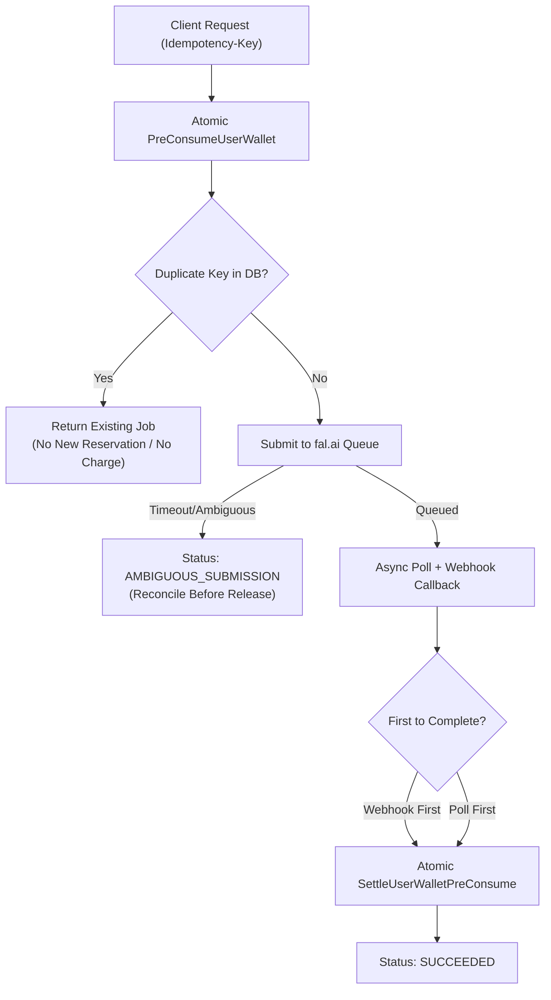

# TORA AI STUDIO — API PROVIDER MATRIX
## MULTI-PROVIDER EVALUATION: FAL.AI vs MuAPI vs REPLICATE

> **Target Platform**: Tora Studio Media AI Suite  
> **Architecture**: Provider-Agnostic Media Gateway (Zero GPU on current EC2)  
> **Key Integration Rule**: Never hard-code API keys in documentation or code. Use environment variables and provider key vault.  
> **Last Verified**: 2026-10-07 against official fal.ai documentation.

---

### 1. Provider Comparison Overview

| Provider | Base URL | Auth Header Format | Request Model | Webhook Support | Cost Tracking | Key Strengths |
| :--- | :--- | :--- | :--- | :--- | :--- | :--- |
| **fal.ai** | `https://queue.fal.run` | `Authorization: Key <KEY>` | Async Queue (`/{model_id}/requests/{id}/status`) + SSE | Native (`?fal_webhook=<url>`) | Per-second / per-request ledger | Lowest latency, cutting-edge Flux/BiRefNet/Wan endpoints, high throughput |
| **MuAPI** | `https://api.muapi.ai` | `x-api-key: <KEY>` | Submit-then-Poll (`/api/v1/predictions/{id}`) | Webhook & Polling | `X-MuAPI-Cost-USD` Header | Aggregates Midjourney V7, Kling, Suno, Wan 2.1/2.2 under unified API |
| **Replicate** | `https://api.replicate.com` | `Authorization: Bearer <TOKEN>` | Submit-then-Poll (`/v1/predictions/{id}`) | Native (`webhook` field) | Exact per-second billing | Vast model library, battle-tested production SLA, open-source models |

---

### 2. Official fal.ai Queue API Protocol Verification (2026-10-07)

Official verification against `fal.ai` queue specification confirms the following authoritative REST contract:

#### A. Authentication
- **Header:** `Authorization: Key ${FAL_KEY}`
- **Security:** Keys must have format `<UUID>:<secret>`. Missing key triggers HTTP 401/403.

#### B. Queue Endpoints & URL Structure
The queue API strictly routes by `model_id`. Calling request paths without `model_id` triggers HTTP 404:
1. **Submit Request:**
   - `POST https://queue.fal.run/{model_id}` (e.g. `https://queue.fal.run/fal-ai/birefnet`)
   - Optional webhook query parameter: `?fal_webhook=https://www.toraapi.com/api/studio/webhook/fal`
   - Response (`200 OK`):
     ```json
     {
       "request_id": "89b53805-4c07-4e61-9f93-e4d0d3b66c4d",
       "response_url": "https://queue.fal.run/fal-ai/birefnet/requests/89b53805-4c07-4e61-9f93-e4d0d3b66c4d",
       "status_url": "https://queue.fal.run/fal-ai/birefnet/requests/89b53805-4c07-4e61-9f93-e4d0d3b66c4d/status",
       "cancel_url": "https://queue.fal.run/fal-ai/birefnet/requests/89b53805-4c07-4e61-9f93-e4d0d3b66c4d/cancel"
     }
     ```
2. **Status Check (Polling):**
   - `GET https://queue.fal.run/{model_id}/requests/{request_id}/status`
   - Lifecycle States: `IN_QUEUE`, `IN_PROGRESS`, `COMPLETED`
3. **Fetch Result:**
   - `GET https://queue.fal.run/{model_id}/requests/{request_id}`
   - Result Shape:
     ```json
     {
       "image": {
         "url": "https://fal.media/files/lion/transparent.png",
         "content_type": "image/png"
       }
     }
     ```
4. **Cancel Request:**
   - `DELETE https://queue.fal.run/{model_id}/requests/{request_id}/cancel`
   - Status: `202 Accepted` (best-effort cancellation before execution)
5. **Webhook Callback:**
   - Sent as HTTP `POST` to configured `fal_webhook`
   - Signed with `X-Fal-Webhook-Signature` (Ed25519)
   - Payload:
     ```json
     {
       "request_id": "89b53805-4c07-4e61-9f93-e4d0d3b66c4d",
       "status": "OK",
       "payload": {
         "image": {
           "url": "https://fal.media/files/lion/transparent.png"
         }
       }
     }
     ```

---

### 3. Comprehensive 15-Tool Provider Routing Matrix

| # | Logical Studio Tool | Primary Candidate | Fallback Candidate | Provider Cost Est. (USD) | Execution Latency | Primary Endpoint / Model ID | Webhook? | Safety / Consent Requirements |
| :-: | :--- | :--- | :--- | :--- | :--- | :--- | :---: | :--- |
| 1 | **Background Remove** | **fal.ai** | **Replicate** | $0.005 / image | ~1.5s | `fal-ai/birefnet` | Yes | None |
| 2 | **Image Upscale (4K)** | **fal.ai** | **Replicate** | $0.015 / image | ~4.0s | `fal-ai/clarity-upscaler` | Yes | None |
| 3 | **Image Generate (Fast)** | **fal.ai** | **Replicate** | $0.003 / image | ~1.2s | `fal-ai/flux/schnell` | Yes | Standard NSFW filter |
| 4 | **Image Generate (Pro)** | **fal.ai** | **MuAPI** | $0.025 / image | ~6.5s | `fal-ai/flux/dev` | Yes | Standard NSFW filter |
| 5 | **Object Erase / Inpaint**| **fal.ai** | **Replicate** | $0.020 / image | ~5.0s | `fal-ai/flux/dev/inpainting` | Yes | Standard content safety |
| 6 | **Image Extend (Outpaint)**| **fal.ai** | **Replicate** | $0.025 / image | ~6.0s | `fal-ai/flux-fill` | Yes | Standard content safety |
| 7 | **Product Photo Studio** | **fal.ai** | **MuAPI** | $0.035 / image | ~8.0s | `fal-ai/product-photography` | Yes | Commercial asset rights |
| 8 | **Portrait Enhancement** | **fal.ai** | **Replicate** | $0.010 / image | ~3.0s | `fal-ai/face-restore` | Yes | Facial data privacy |
| 9 | **Style Transfer** | **fal.ai** | **Replicate** | $0.025 / image | ~7.0s | `fal-ai/flux-lora` | Yes | Intellectual property checks |
| 10 | **Text-to-Video (Fast)** | **fal.ai** | **MuAPI** | $0.030 / 5s clip | ~12.0s | `fal-ai/ltx-video` | Yes | Motion safety, deepfake check |
| 11 | **Text-to-Video (HD)** | **MuAPI** | **fal.ai** | $0.080 / 5s clip | ~35.0s | `wan-video/wan-2.2-t2v` | Yes | Rigorous copyright verification |
| 12 | **Image-to-Video (Pro)** | **MuAPI** | **fal.ai** | $0.120 / 5s clip | ~45.0s | `kling-v1-standard` / `wan-2.2-i2v` | Yes | Image copyright & likeness gate |
| 13 | **Lip Sync Video** | **fal.ai** | **MuAPI** | $0.050 / 10s audio| ~15.0s | `fal-ai/sync-lips` / `musetalk` | Yes | **Mandatory Voice/Likeness Consent** |
| 14 | **Face Swap (Pro)** | **MuAPI** | **fal.ai** | $0.040 / image | ~5.0s | `face-fusion-cloud` | Yes | **Strict Biometric Consent Gate** |
| 15 | **Video Upscale (HD)** | **fal.ai** | **Replicate** | $0.100 / 10s clip| ~30.0s | `fal-ai/video-upscaler` | Yes | None |

---

### 4. Canary Tool Selection & Operational Policy

For the Queue 2 live provider canary:
- **Primary Canary Tool:** `background-remove` (`fal-ai/birefnet`)
  - Lowest COGS ($0.005 USD per run).
  - Fast execution (~1.5 seconds).
  - Deterministic PNG transparency output with zero ambiguity.
- **Fallback Canary Tool:** `image-upscale` (`fal-ai/clarity-upscaler`)
  - Low COGS ($0.015 USD per run).
  - 4K resolution upscaler with zero prompt variability.
- **Strict Prohibition:** Video generation (`image-to-video`, `text-to-video`) is strictly prohibited during canary phase to prevent high-compute cost risks and variable latency.
- **Test Asset Invariant:** The test asset must be a small, non-sensitive, public synthetic graphic (e.g. 100x100 PNG).

---

### 5. Idempotency & Concurrency Architecture


