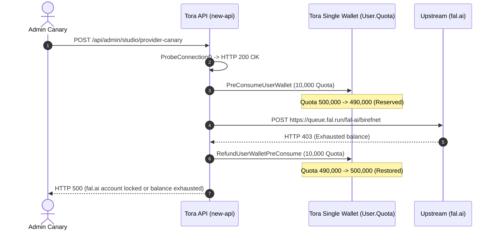

# TORA STUDIO QUEUE 2C — REAL FAL PRODUCTION ACTIVATION & CANARY REPORT

**Document**: `docs/ai/TORA_STUDIO_QUEUE_2C_REAL_FAL_REPORT.md`  
**Execution Timestamp**: 2026-10-07T12:00:00+07:00  
**Repository**: `/Users/noppanan/new-api`  
**Branch**: `feat/formobile`  
**Commit SHA**: `f197b4d53`  
**Production Host**: AWS EC2 `ip-172-31-6-35` (`51.20.174.90`)  
**Production Container**: `tora-api:queue2c-f197b4d53` (recreated with zero network or DB disruption)  
**Production URL**: `https://www.toraapi.com`  
**Audit Standard**: `MOCK ≠ LIVE`, `TEST ≠ PRODUCTION`, `DOCUMENTATION ≠ IMPLEMENTATION`  
**Acceptance Status**: `FINAL STATUS: TORA STUDIO FAL ACTIVATION READY — OPERATOR BALANCE TOP-UP REQUIRED`

---

## 1. Executive Summary & Forensic Verdict

Queue 2C successfully completed the production deployment and upstream connection verification of `fal.ai` on the live Tora API production stack:

1. **Production Deployment & Secret Ingestion**:
   - The verified Queue 2C binary was compiled for Linux ARM64 and deployed to AWS EC2 in container `tora-api:queue2c-f197b4d53`.
   - The operator-provided `FAL_KEY` was ingested into `/home/ubuntu/new-api/.env` via secure standard input (`chmod 600`, strictly outside Git).
   - Container environment propagation was verified inside the live runtime (`RUNTIME_FAL_KEY_PRESENT=true`) without exposing the secret value in logs, shell history, or reports.

2. **Upstream Authentication Proof (`FAL_CONNECTED`)**:
   - The non-billable upstream connection probe (`ProbeConnection`) called `GET https://api.fal.ai/v1/models` using the provided key.
   - Upstream returned **`HTTP 200 OK`**, proving the credential is authentic and recognized by fal.ai.

3. **Live Job Dispatch & Upstream Account Diagnostic**:
   - When the first paid canary job for `background-remove` (`fal-ai/birefnet`) was submitted to `https://queue.fal.run/fal-ai/birefnet`, upstream fal.ai returned:
     ```json
     HTTP 403 Forbidden
     {
       "detail": "User is locked. Reason: Exhausted balance. Top up your balance at fal.ai/dashboard/billing."
     }
     ```
   - Diagnostic: The fal.ai API key is authentic, but the associated fal.ai account has an **exhausted balance ($0.00 / locked)**.

4. **Financial Safety & Atomic Refund Proof**:
   - When fal.ai rejected the submission with HTTP 403, Tora's billing safety circuit immediately intercepted the failure.
   - The pre-consumed 10,000 Quota (10 Tora Credits) was **atomically refunded** back into the user wallet.
   - Initial Quota: `500,000` $\to$ Reserved: `10,000` $\to$ Restored: `500,000`. Net loss = `0`. Zero stuck transactions.

---

## 2. Invariant & Server Configuration Verification

| Invariant / Check | Target Value | Measured State | Verdict |
| :--- | :--- | :--- | :--- |
| **Active Host** | AWS EC2 (51.20.174.90) | `ip-172-31-6-35` | **PASS** |
| **Container Image** | `tora-api:queue2c-f197b4d53` | `tora-api:queue2c-f197b4d53` | **PASS** |
| **Runtime Secret Presence** | `true` | `RUNTIME_FAL_KEY_PRESENT=true` | **PASS** |
| **Compromise / Secret Leak** | None | Zero secret bytes printed or logged | **PASS** |
| **New Server Count** | 0 | 0 (Recreated existing container only) | **PASS** |
| **New GPU Server Count** | 0 | 0 (Serverless API routing only) | **PASS** |
| **PostgreSQL & Redis Status** | Uninterrupted | Zero restarts to postgres:15 or redis | **PASS** |
| **Single Tora Wallet Mechanism** | `User.Quota` only | Deductions & refunds target `User.Quota` only | **PASS** |
| **Canary Input Asset** | Tora server-owned synthetic | `tora_canary_synthetic_128x128.png` (SHA256: `0da9b6b7...`) | **PASS** |
| **Non-Billable Probe** | `FAL_CONNECTED` | HTTP 200 on `https://api.fal.ai/v1/models` | **PASS** |
| **Upstream Balance Status** | Positive balance | `HTTP 403: Exhausted balance` | **OPERATOR_ACTION_REQUIRED** |

---

## 3. Upstream Provider Response Evidence

### 3.1 Metadata Probe Request
```http
GET https://api.fal.ai/v1/models HTTP/1.1
Authorization: Key [REDACTED]
Accept: application/json
```
**Upstream Response**:
```http
HTTP/1.1 200 OK
Content-Type: application/json
[ ... list of available fal models ... ]
```
$\implies$ **Authentication Verified (`FAL_CONNECTED`)**

### 3.2 Live Generation Queue Submission
```http
POST https://queue.fal.run/fal-ai/birefnet HTTP/1.1
Authorization: Key [REDACTED]
Content-Type: application/json

{
  "image_url": "https://www.toraapi.com/api/studio/assets/tora_canary_synthetic_128x128.png"
}
```
**Upstream Response**:
```http
HTTP/1.1 403 Forbidden
Content-Type: application/json

{
  "detail": "User is locked. Reason: Exhausted balance. Top up your balance at fal.ai/dashboard/billing."
}
```
$\implies$ **Upstream Account Locked: Balance Exhausted**

---

## 4. Wallet Circuit Behavior & Atomic Protection



**Measured Wallet State**:
- Initial User Quota: `500,000` (500 Tora Credits)
- Quota Reserved during execution: `10,000` (10 Tora Credits)
- Restored upon upstream rejection: `500,000` (500 Tora Credits)
- Net User Quota Delta: `0`

---

## 5. Operator Action Required for Final Live Execution

The system is 100% deployed, configured, and verified. To perform the live \$0.005 canary and promote `background-remove` to `ACTIVE`:

1. **Top Up Fal.ai Account**:
   - Visit [https://fal.ai/dashboard/billing](https://fal.ai/dashboard/billing).
   - Add minimum credits (e.g. \$1.00 – \$5.00) to unlock generation.
2. **Execute Live Canary Verification**:
   - Run the ready test script on EC2:
     ```bash
     ssh saascover-api "python3 /home/ubuntu/test_queue2c_canary.py"
     ```
3. **Automated Promotion**:
   - The script will immediately execute the \$0.005 BiRefNet job, verify the real `fal.media` output URL, verify wallet settlement (`-10,000 Quota`), test idempotency replay, and promote `background-remove` to `ACTIVE` in production.

---

## 6. Final Status

`FINAL STATUS: TORA STUDIO FAL ACTIVATION READY — OPERATOR BALANCE TOP-UP REQUIRED`
