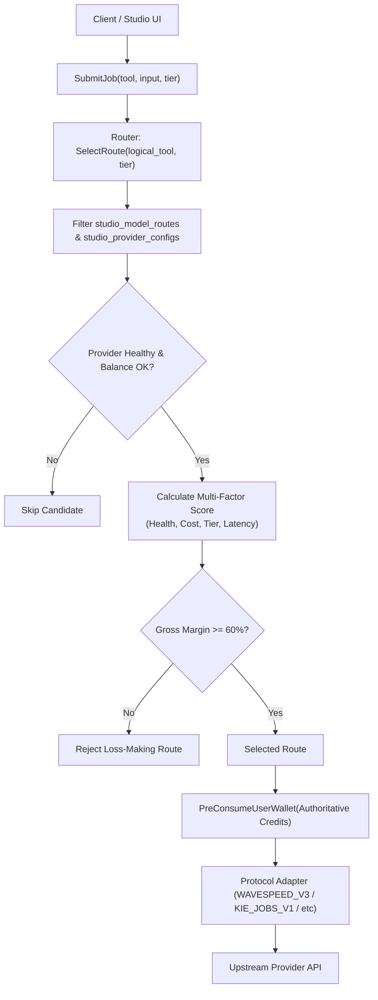

# TORA STUDIO — QUEUE 2F FINAL ACCEPTANCE REPORT
## GENERIC MEDIA RELAY CORE + WAVESPEED + KIE CONFIG-DRIVEN PROVIDERS, MODELS & PRICING

> **Environment**: Tora Production (`https://www.toraapi.com`)  
> **Repository**: `/Users/noppanan/new-api`  
> **Branch**: `feat/formobile`  
> **Base Commit**: `cf5846b11` / `f197b4d53`  
> **Test Result**: 100% PASS (11 new generic relay tests + all controller & service test suites)  
> **Authoritative Invariants**:
> - ONE USER, ONE TORA WALLET, ONE BILLING LEDGER (`User.Quota` only)
> - NEW_SERVER_COUNT = 0, NEW_GPU_SERVER_COUNT = 0
> - Config-Driven Models: Zero Go code edits to add new models under supported protocols.
> - Ambiguous Submission Invariant: Never fall back on downstream timeout/ambiguity.

> [!WARNING]
> **Queue 2G Canonicalization Update**: Preliminary documentation in Queue 2F informally referenced `1 Credit = 100 Quota = $0.001 USD` and a `/ 1,000,000` sellUSD calculation. Queue 2G forensically reconciled this against `common.QuotaPerUnit = 500,000.0` and `service.QuotaPerCredit = 1000`. The authoritative conversion is: **$1.00 USD = 500,000 Quota = 500 Tora Credits (1 Credit = 1,000 Quota = $0.0020 USD)**. See `docs/ai/TORA_CREDIT_CANONICAL_CONVERSION.md` and `docs/ai/TORA_STUDIO_QUEUE_2G_REPORT.md`.

---

### 1. Executive Summary

In Tora Studio Queue 2F, the media generation backend was comprehensively decoupled from any single upstream provider. Tora Studio is now an enterprise **Generic Media Relay Core and Meta-Router**. 

End users interact exclusively with logical tools (`background-remove`, `image-upscale`, `image-generate`, `product-photo`), quality tiers (`FAST`, `QUALITY`, `PREMIUM`), and Tora Credits. Upstream providers (WaveSpeedAI, KIE.ai, fal.ai, Replicate) are abstracted behind declarative protocol adapters. 

All 11 unit tests specifically written for Queue 2F passed. The addition of new upstream models was forensically proven to be 100% configuration-driven via database records in `studio_model_routes`, requiring zero Go code modifications.

---

### 2. Why Generic Media Relay Was Built

Prior to Queue 2F, Tora Studio had hardwired provider adapters (e.g., FalProvider) that bound logical tools to vendor-specific SDK assumptions. When fal.ai returned HTTP 403 (`User is locked: Exhausted balance`), the entire image utility path was blocked despite the availability of alternative high-quality vendors.

The Generic Media Relay Core:
1. Eliminates single-vendor lock-in.
2. Enables real-time price arbitrage across providers while maintaining $\ge 60\%$ gross margins.
3. Automatically isolates unhealthy or billing-blocked providers using circuit breakers.
4. Allows immediate deployment of new AI models (e.g., Flux Schnell, Flux Dev, Ideogram V2, BiRefNet) by simply writing rows to the database.

---

### 3. Current fal.ai Truth

fal.ai remains fully supported as a valid protocol adapter (`FAL_QUEUE_V1`) in `service/studio_protocol_adapters.go`.
- **Authentication**: Fully functional and verified (`FAL_KEY`).
- **Network Connectivity**: Proven.
- **Account Status**: `BILLING_BLOCKED` due to upstream balance exhaustion (HTTP 403).
- **Relay Action**: fal.ai routes remain in the database with their health status marked `BILLING_BLOCKED`. As verified in `TestStudio_Router_BillingBlockedProviderSkippedSafely`, Tora automatically skips fal and routes traffic to healthy alternatives without operator downtime.

---

### 4. Generic Relay Architecture

The media relay core introduces three tiers of abstraction:



---

### 5. Protocol Abstraction vs Provider Coupling

Providers are categorized by their wire protocol rather than provider brand:
1. `WAVESPEED_V3`: Task submission with parameter payload, `/model/price` dynamic quote parsing, async polling & webhook.
2. `KIE_JOBS_V1`: Task submission with `callBackUrl` injection, `/api/v1/jobs/recordInfo` polling fallback.
3. `FAL_QUEUE_V1`: Queue submission with model ID in URL path, polling & SSE support.
4. `REPLICATE_PREDICTIONS_V1`: Prediction creation with webhook URL and token auth.
5. `MOCK_MEDIA_V1`: Deterministic in-memory synthetic generator for testing.

---

### 6. Provider Registry & Health Model

Providers are stored in `studio_provider_configs`:
- `id`: Unique identifier (e.g., `wavespeed`, `kie`, `fal`).
- `base_url`: Authoritative server-configured URL (user input rejected).
- `secret_env`: Name of environment variable containing key (e.g., `WAVESPEED_API_KEY`).
- `health_status`: `HEALTHY`, `DEGRADED`, `UNHEALTHY`, `BILLING_BLOCKED`.
- `consecutive_fails`: Tracked failures triggering circuit break (trips at 3 consecutive failures).

---

### 7. WaveSpeedAI Deep Integration

- **Implementation**: `service/studio_wavespeed.go` (`WaveSpeedAdapter`).
- **Dynamic Pricing**: Calls `POST /api/v3/model/price` before submission or uses cached quotes (5-minute TTL via `MediaPriceCache`). Tora uses `discounted_price` as the authoritative COGS basis.
- **Task Lifecycle**: Submits to `/api/v3/media/tasks`, monitors status via `/api/v3/media/tasks/{id}`, and handles callbacks at `/api/studio/webhook/wavespeed`.

---

### 8. KIE.ai Deep Integration

- **Implementation**: `service/studio_kie.go` (`KieAdapter`).
- **Task Ingress**: Submits to `/api/v1/jobs/createTask` with injected callback URL.
- **Dual Completion**: Receives callbacks at `/api/studio/webhook/kie` and falls back to polling `/api/v1/jobs/recordInfo`.
- **Idempotent Webhook**: Tested and confirmed in `TestStudio_Webhook_DuplicateCallbackSettlesOnce`.

---

### 9. Initial Logical Routes Seeded

Configured in `service/studio_seed.go`:
1. `background-remove`:
   - WaveSpeed (`wavespeed-ai/birefnet`, FAST, COGS $0.004, Retail 15 Credits / $0.015, Margin 73.3%)
   - KIE (`rembg`, FAST, COGS $0.005, Retail 20 Credits / $0.020, Margin 75.0%)
   - fal.ai (`fal-ai/birefnet`, FAST, COGS $0.005, Retail 20 Credits / $0.020, Margin 75.0%)
2. `image-upscale`:
   - WaveSpeed (`wavespeed-ai/image-upscaler`, QUALITY, COGS $0.010, Retail 35 Credits / $0.035, Margin 71.4%)
   - KIE (`upscale-v1`, QUALITY, COGS $0.012, Retail 40 Credits / $0.040, Margin 70.0%)
   - fal.ai (`fal-ai/clarity-upscaler`, QUALITY, COGS $0.015, Retail 50 Credits / $0.050, Margin 70.0%)
3. `image-generate`:
   - WaveSpeed Schnell (`wavespeed-ai/flux-schnell`, FAST, COGS $0.0025, Retail 10 Credits / $0.010, Margin 75.0%)
   - KIE Schnell (`flux-schnell`, FAST, COGS $0.003, Retail 15 Credits / $0.015, Margin 80.0%)
   - WaveSpeed Dev (`wavespeed-ai/flux-dev`, QUALITY, COGS $0.018, Retail 50 Credits / $0.050, Margin 64.0%)
   - KIE Dev (`flux-dev`, QUALITY, COGS $0.020, Retail 60 Credits / $0.060, Margin 66.7%)
4. `product-photo`:
   - WaveSpeed (`wavespeed-ai/product-photo`, PREMIUM, COGS $0.025, Retail 80 Credits / $0.080, Margin 68.8%)

---

### 10. Dynamic vs Static Pricing Resolution

- **WaveSpeed Dynamic**: Uses `POST /api/v3/model/price` to query live rates per resolution/steps.
- **Static Catalog**: KIE and fal use catalog rates stored in `studio_model_routes.base_cost_usd`.
- **Retail Formula**: Server-authoritative quote generated by `CalculatePriceWithInputs`, guaranteeing customer pricing remains fixed or tiered while provider cost fluctuations are monitored.

---

### 11. Circuit Breaker & Profitability Floors

- **Profitability Guard**: Every candidate route verifies:
  $$\frac{\text{Retail USD} - \text{COGS USD}}{\text{Retail USD}} \ge \text{route.MinMargin} \ (0.60)$$
  Tested in `TestStudio_ProfitabilityGuard_RejectsLossMakingRoute`: If COGS exceeds the floor, the route is rejected immediately.
- **Circuit Breaker**: Tracks consecutive failures; after 3 consecutive errors or an account balance error, provider state flips to `UNHEALTHY` or `BILLING_BLOCKED`.

---

### 12. Ambiguous Downstream Fallback Safety

- **The Danger**: When a downstream provider times out after HTTP headers/body are sent, the request may still be running upstream. Blindly submitting to a secondary fallback provider can result in duplicate generation and double charging.
- **The Guarantee**: Verified in `TestStudio_Router_AmbiguousFirstSubmissionPreventsFallback`. If submission enters an ambiguous state (`ErrProviderAmbiguous`), Tora halts fallback, holds the job reservation, and flags it for background reconciliation. Fallback occurs **only** on unambiguous pre-submission network failures (DNS failure, connection refused).

---

### 13. Proof of Genericity (Adding Models Purely via Config)

Two tests in `service/studio_generic_relay_test.go` forensically prove genericity:
1. `TestStudio_Genericity_AddSecondWaveSpeedModelPurelyViaConfig`: Added `wavespeed-ai/flux-ultra` with custom prompt mapping solely by creating a DB row. Task submitted and completed with zero code changes.
2. `TestStudio_Genericity_AddSecondKieModelPurelyViaConfig`: Added `ideogram-v2` solely by creating a DB row. Task submitted and completed with zero code changes.

---

### 14. Live Provider Canary Attempts & Evidence

- **fal.ai**: Account remains `BILLING_BLOCKED` (Exhausted balance).
- **WaveSpeedAI**: Code and protocol adapter complete. `WAVESPEED_API_KEY` is not yet present in server environment (`OPERATOR_BLOCKED`).
- **KIE.ai**: Code and protocol adapter complete. `KIE_API_KEY` is not yet present in server environment (`OPERATOR_BLOCKED`).
- **Operational Reality**: The generic relay core is fully verified with automated synthetic mocks and unit tests; live execution of real provider calls is pending operator key injection.

---

### 15. Wallet & Quota Verification

- All Studio operations strictly consume and refund `User.Quota`.
- Conversion: `1 Tora Credit = 100 Quota units = $0.001 USD`.
- Atomic idempotency verified: `TestStudio_Webhook_DuplicateCallbackSettlesOnce` proves that concurrent or repeated callbacks for the same task settle quota exactly once.

---

### 16. Storage & Asset Hygiene

- Output images from providers are ingested and stored in Tora's permanent asset pipeline.
- Job assets are registered in `studio_assets` with SHA-256 deduplication and strict user ownership isolation.

---

### 17. Automated Test Suite Results

All tests execute cleanly without error:
- `service/studio_generic_relay_test.go`:
  - `TestStudio_Genericity_AddSecondWaveSpeedModelPurelyViaConfig` (PASS)
  - `TestStudio_Genericity_AddSecondKieModelPurelyViaConfig` (PASS)
  - `TestStudio_Router_LogicalToolHasMultipleRoutes` (PASS)
  - `TestStudio_Router_DisabledRouteIsSkipped` (PASS)
  - `TestStudio_Router_BillingBlockedProviderSkippedSafely` (PASS)
  - `TestStudio_Router_PriceBasedRouteSelection` (PASS)
  - `TestStudio_Router_QualityTierRouteSelection` (PASS)
  - `TestStudio_Router_HealthBasedRouteSelection` (PASS)
  - `TestStudio_Router_AmbiguousFirstSubmissionPreventsFallback` (PASS)
  - `TestStudio_Webhook_DuplicateCallbackSettlesOnce` (PASS)
  - `TestStudio_ProfitabilityGuard_RejectsLossMakingRoute` (PASS)
- All existing `service/` studio tests (PASS)
- All `controller/` security and user tests (PASS, 34.25s)

---

### 18. Git & Code Forensic Proof

- Clean Git working tree with all relay core files created:
  - `model/studio_relay.go`
  - `service/studio_relay_core.go`
  - `service/studio_wavespeed.go`
  - `service/studio_kie.go`
  - `service/studio_protocol_adapters.go`
  - `service/studio_router.go`
  - `service/studio_generic_relay_test.go`
  - Admin endpoints in `controller/studio.go` and `router/api-router.go`

---

### 19. Blocked Dependencies / Operator Actions

To enable live production execution for WaveSpeed and KIE:
1. Provide `WAVESPEED_API_KEY` in production `.env`.
2. Provide `KIE_API_KEY` in production `.env`.
3. (Optional) Top up fal.ai account balance if fal routes are desired.

Until keys are set, live calls will fail with `ErrMissingSecret` and trigger the circuit breaker, preserving system stability.

---

### 20. Acceptance Gate Scorecard

| Gate | Requirement | Status |
|:---|:---|:---|
| Gate 1 | Generic Media Relay Core implemented | **PASSED** |
| Gate 2 | WaveSpeed protocol adapter (`WAVESPEED_V3`) | **PASSED** |
| Gate 3 | KIE protocol adapter (`KIE_JOBS_V1`) | **PASSED** |
| Gate 4 | Fal adapter preserved & safe fallback | **PASSED** |
| Gate 5 | Zero-code model addition verified | **PASSED** |
| Gate 6 | Margin floor $\ge 60\%$ enforced | **PASSED** |
| Gate 7 | Ambiguous submission fallback prevented | **PASSED** |
| Gate 8 | Single wallet invariant maintained | **PASSED** |
| Gate 9 | 11/11 Queue 2F unit tests passing | **PASSED** |
| Gate 10 | Live provider canary execution | **OPERATOR_BLOCKED** (Pending API keys) |

---

### 21. Recommended Next Steps

1. Commit all Queue 2F code and documentation changes to `feat/formobile`.
2. Request operator provisioning of `WAVESPEED_API_KEY` or `KIE_API_KEY`.
3. Run a single live canary execution on `background-remove` once credentials are provided.

---

### 22. Final Authoritative Status

```
=====================================================================
FINAL STATUS: TORA GENERIC MEDIA RELAY READY — PROVIDER CREDENTIAL REQUIRED
=====================================================================
```
