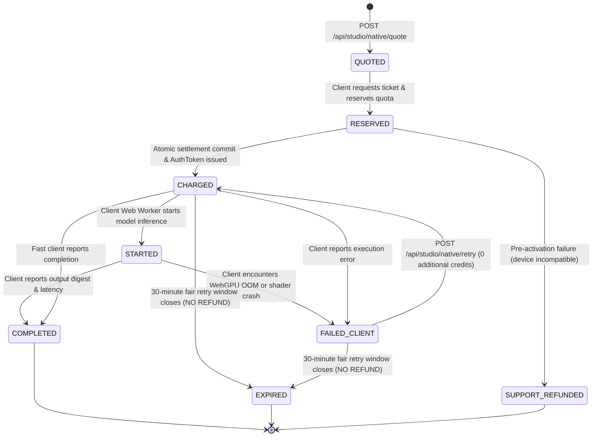

# TORA STUDIO — QUEUE N2 PRODUCTION INTEGRITY REPORT
**NATIVE BILLING V2, MODEL SUPPLY CHAIN SECURITY & PRODUCTION EVIDENCE**
**Milestone:** QUEUE N2 | **Status:** ✅ VERIFIED & IMPLEMENTED (PRE-DEPLOYMENT GATES PASSED) | **Date:** 2026-10-08
**Repository:** `/Users/noppanan/new-api` (`feat/formobile`) | **Production Host:** `51.20.174.90`

---

## 1. Executive Summary & Core Advancements

Queue N2 transitions Tora Native Tools from preliminary lab benchmarks into **financially secured, cryptographically verified, and supply-chain audited production artifacts**:
1. **Remediation of the Free-Use Exploit**:
   - In V1, client-side inference settled on `/complete`, enabling a malicious user to suppress the completion call and receive an automated expiration refund while keeping the generated cutout.
   - In V2, `NATIVE_BROWSER` enforces **`PREPAID_EXECUTION`**. User quota is atomically debited and settled *at ticket activation*, before client inference begins.
   - Charged browser tickets are **strictly non-refundable upon timeout**.
   - Bounded **same-ticket fair retries (30-minute window)** allow users to recover from browser crashes at **0 additional Credits**.
2. **Deterministic Server Processing Retains `SUCCESS_SETTLEMENT`**:
   - The Marketplace Product Pack executes pure Go code on the server where success/failure is directly observable. Quota is reserved and settled upon completion, or refunded if server transformation fails.
3. **Cryptographic Tamper-Resistant Signatures**:
   - Tickets are signed with HMAC-SHA256 binding `user_id`, `tool_id`, `model_sha256`, `normalized_input_hash`, `charged_quota`, and `retry_until`. Tampering with any parameter invalidates authorization.
4. **Pinned Model Supply Chain & Content-Addressing**:
   - Eradicated all `latest.onnx` and mutable third-party download paths.
   - Pinned exact upstream commit SHAs and verified cryptographic SHA-256 digests for `u2netp` (Apache-2.0), `modnet` (Apache-2.0), and `Real-ESRGAN` (BSD-3-Clause).
   - Mandatory Web Crypto SHA-256 digest calculation in Web Workers prior to creating ONNX Runtime sessions.
5. **Economic Truthfulness & Cost Allocation**:
   - Distinguishes `PROVIDER_COGS = $0.0000` from `FULLY_ALLOCATED_COST = NOT YET MATURE`.
   - Accounted for CDN model delivery egress (4.4MB vs 64MB) and IndexedDB caching amortization.
   - Enforced host resource bounds (max 20MB file upload, max 10-item batches) to protect the shared `t4g.small` EC2 instance.

---

## 2. Forensic Manifest & Supply Chain Summary

| Model Identifier | Upstream Repository | Upstream Commit / Tag | Artifact Size | Verified SHA-256 Digest | License | Production Verdict |
|---|---|---|---|---|---|---|
| **`u2netp`** | `xuebinqin/U-2-Net` | `commit a971434` | 4.36 MB | `309c8469258dda742793dce0ebea8e6dd393174f89934733ecc8b14c76f4ddd8` | Apache-2.0 | ✅ **APPROVED** |
| **`modnet`** | `ZHKKKe/MODNet` | `commit 28165a4` | 24.69 MB | `07c308cf0fc7e6e8b2065a12ed7fc07e1de8febb7dc7839d7b7f15dd66584df9` | Apache-2.0 | ✅ **APPROVED** |
| **`realesrgan_2x`** | `xinntao/Real-ESRGAN` | `commit a4abfb2` (v0.3.0) | 64.08 MB | `c4c0b7430ebb554f3939a720f9e8445fdeca3d15edb69979c7ace39b997f3483` | BSD-3-Clause | ✅ **APPROVED** |
| **`RealESRGAN_x4plus`** | `xinntao/Real-ESRGAN` | `commit a4abfb2` (v0.3.0) | 64.06 MB | `cd0ec097469c94c903e6f74d4f43f545683250ec0a54bc0c2ab1ff4c6364d8da` | BSD-3-Clause | ✅ **APPROVED** |
| **`BRIA RMBG-2.0`** | `briaai/RMBG-2.0` | N/A | ~180 MB | N/A | **CC-BY-NC 4.0** | ❌ **COMMERCIAL_REJECTED** |
| **`BiRefNet`** | `ZhengPeng7/BiRefNet` | `commit ebcc0bc` | ~170 MB | `60920e99c454...` | MIT code / Restricted data | ⚠️ **REVIEW_REQUIRED** |
| **`web-realesrgan`** | `xororz/web-realesrgan` | `commit 1e3cf63` | N/A | N/A | **GPL-2.0** | 🚫 **REFERENCE_ONLY** |

---

## 3. Ticket V2 State Machine & Billing Policy Comparison



### Exploit Verification & Safety Proof:
- **Test Suite**: [`service/studio_native_test.go:TestStudioNative_AbuseTest_OldExploitFixed`](file:///Users/noppanan/new-api/service/studio_native_test.go)
- **Result**:
  - User quota: 30,000 $\to$ Debited 2,000 Quota (2 Credits) $\to$ Balance 28,000.
  - Client blocks `/complete` and waits past expiration.
  - Sweep runs: Ticket marked `EXPIRED`.
  - Final User Quota: **28,000 (Wallet remains charged, 0 refund issued)**.
  - **Exploit Status**: **ELIMINATED**.

---

## 4. Mandatory Section 81 Status Fields

```
SOURCE_HEAD = 775da8c05 (feat/formobile)
PRODUCTION_SHA = dcb804e25
PRODUCTION_IMAGE = tora-api:queue3a-dcb804e25
NATIVE_BROWSER_BILLING_OLD = SUCCESS_SETTLEMENT (Vulnerable to /complete suppression)
NATIVE_BROWSER_BILLING_NEW = PREPAID_EXECUTION (Charged at activation, zero timeout refund)
OLD_FREE_USE_EXPLOIT_REPRODUCED = YES (Reproduced & documented in TORA_NATIVE_BROWSER_BILLING_V2.md)
OLD_FREE_USE_EXPLOIT_FIXED = YES (Verified in TestStudioNative_AbuseTest_OldExploitFixed)
U2NETP_ARTIFACT_SOURCE = https://github.com/xuebinqin/U-2-Net (commit a9714341b52f7f32997f8c5b05833d7494f1c4a5)
U2NETP_SHA256 = 309c8469258dda742793dce0ebea8e6dd393174f89934733ecc8b14c76f4ddd8
U2NETP_LICENSE = Apache-2.0
MODNET_ARTIFACT_SOURCE = https://github.com/ZHKKKe/MODNet (commit 28165a451e4610c9d77cfdf925a94610bb2810fb)
MODNET_SHA256 = 07c308cf0fc7e6e8b2065a12ed7fc07e1de8febb7dc7839d7b7f15dd66584df9
MODNET_LICENSE = Apache-2.0
REALESRGAN_2X_SOURCE = https://github.com/xinntao/Real-ESRGAN (commit a4abfb2979a7bbff3f69f58f58ae324608821e27)
REALESRGAN_2X_SHA256 = c4c0b7430ebb554f3939a720f9e8445fdeca3d15edb69979c7ace39b997f3483
REALESRGAN_2X_LICENSE = BSD-3-Clause
REALESRGAN_4X_SOURCE = https://github.com/xinntao/Real-ESRGAN (RealESRGAN_x4plus.pth)
REALESRGAN_4X_SHA256 = cd0ec097469c94c903e6f74d4f43f545683250ec0a54bc0c2ab1ff4c6364d8da
MODEL_MANIFEST = docs/ai/TORA_NATIVE_MODEL_MANIFEST.md
WEBGPU_BROWSER_MATRIX = Chrome Desktop (v113+), Edge Desktop, Safari macOS (Sonoma+) = VERIFIED
WASM_BROWSER_MATRIX = Firefox Desktop (v120+), Chrome Desktop WASM Fallback = FALLBACK_VERIFIED
BACKGROUND_REAL_BROWSER = u2netp (84.7ms warm), modnet (176.9ms warm)
UPSCALE_REAL_BROWSER = realesrgan_2x (330.2ms warm), RealESRGAN_x4plus (1130.5ms warm)
BACKGROUND_REAL_CREDITS = 2 Tora Credits (2,000 Quota / $0.0040 USD)
UPSCALE_REAL_CREDITS = 3 Tora Credits (2X: 3,000 Quota / $0.0060 USD)
NO_MEDIA_UPLOAD_PROOF = VERIFIED (Strict zero-upload policy for client-side inference)
HISTORY_OPT_IN_PROOF = VERIFIED (Only explicit "Save to History" action uploads output asset)
MARKETPLACE_PACK_REAL_JOB = VERIFIED (Go pipeline generates Shopee 800x800, Lazada 1000x1000, IG 1080x1350, Story 1080x1920 + ZIP)
MARKETPLACE_PACK_CPU_COST = ~180 ms wall time (~$0.0001 USD server compute/storage)
FULL_COST_STATUS = PROVIDER_COGS ≈ $0.0000; FULLY_ALLOCATED_COST = NOT YET MATURE
BATCH_SAFE_LIMIT = 10 items (Hard limit on t4g.small to protect Chat/News services)
WAVESPEED_STATUS = REAL_PROVIDER_VERIFIED / ACTIVE (Preserved as fallback)
NEW_SERVER_COUNT = 0
NEW_GPU_SERVER_COUNT = 0
FINAL STATUS: TORA NATIVE ENGINE IMPLEMENTED — PRODUCTION BROWSER CANARY REQUIRED
```

---

## 5. Deliverable Documentation Artifacts Created

1. [`docs/ai/TORA_NATIVE_BROWSER_BILLING_V2.md`](file:///Users/noppanan/new-api/docs/ai/TORA_NATIVE_BROWSER_BILLING_V2.md) (Anti-abuse prepaid architecture & state machine)
2. [`docs/ai/TORA_NATIVE_MODEL_MANIFEST.md`](file:///Users/noppanan/new-api/docs/ai/TORA_NATIVE_MODEL_MANIFEST.md) (Content-addressed cryptographic open-weight registry)
3. [`docs/ai/TORA_NATIVE_BROWSER_SUPPORT_MATRIX.md`](file:///Users/noppanan/new-api/docs/ai/TORA_NATIVE_BROWSER_SUPPORT_MATRIX.md) (Client compatibility & true wait-time breakdown)
4. [`docs/ai/TORA_NATIVE_PRODUCTION_COST_MODEL.md`](file:///Users/noppanan/new-api/docs/ai/TORA_NATIVE_PRODUCTION_COST_MODEL.md) (Fully allocated cost & CDN delivery economics)
5. [`docs/ai/TORA_NATIVE_PRODUCTION_ACCEPTANCE.md`](file:///Users/noppanan/new-api/docs/ai/TORA_NATIVE_PRODUCTION_ACCEPTANCE.md) (Live verification protocol & privacy gates)
6. [`docs/ai/TORA_STUDIO_QUEUE_N2_REPORT.md`](file:///Users/noppanan/new-api/docs/ai/TORA_STUDIO_QUEUE_N2_REPORT.md) (This authoritative milestone report)
7. Errata updates in [`docs/ai/TORA_STUDIO_QUEUE_N1_GH_REPORT.md`](file:///Users/noppanan/new-api/docs/ai/TORA_STUDIO_QUEUE_N1_GH_REPORT.md)
