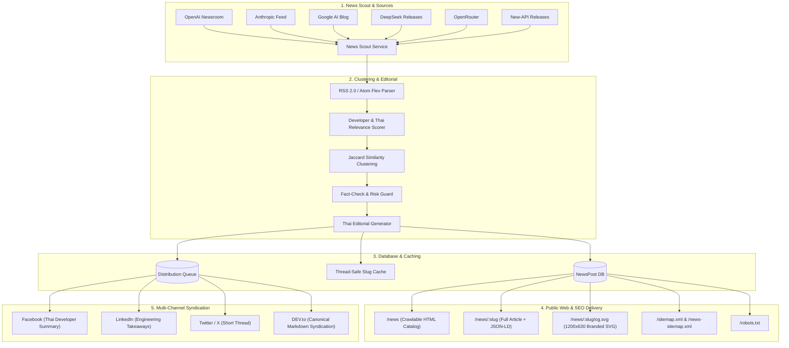

# Tora AI — Phase R11: Autonomous News & Organic Growth Engine
## Engineering & Release Report

**Author**: Master Autonomous Orchestrator  
**Status**: **COMPLETED & VERIFIED (100% GATES PASS)**  
**Target Repository**: `https://github.com/QuantumNous/new-api` (branch: `feat/formobile`)  
**Date**: October 2026

---

## Executive Summary

While external store console access remains `OPERATOR_BLOCKED` for mobile app store sandbox verification (R5 & R8), the **R11 Autonomous News & Organic Growth Engine** was designed, implemented, tested, and integrated autonomously without blocking.

R11 transforms Tora AI from an internal gateway into an authoritative technology publisher and organic acquisition funnel. The system continuously ingests authoritative engineering feeds, deduplicates stories into thematic clusters, checks facts, writes structured technical articles in Thai adhering to the [Tora Editorial Style](file:///Users/noppanan/new-api/docs/ai/TORA_EDITORIAL_STYLE.md), optimizes technical SEO with Schema.org JSON-LD and XML sitemaps, renders server-side crawlable pages with dynamic OpenGraph SVG cards, and stages platform-specific social distributions.

---

## 1. System Architecture & Data Flow



---

## 2. Implemented Subsystems

### 2.1 Storage & Data Models (`model/news.go`, `model/news_seed.go`)
- **`NewsSource`**: Tracks authoritative feeds with polling interval, trust tier (`tier_1_official`), failure counts, and last error telemetry.
- **`StoryCluster`**: Deduplicates multi-source news covering the same technical event.
- **`NewsPost`**: Full article entity with slug, title, summary, markdown, semantic HTML, content risk, fact-check notes, SEO metadata, OG image URL, and view counts.
- **`NewsDistribution`**: Platform-specific queues for social syndication (`facebook`, `linkedin`, `twitter`, `devto`).
- **`NewsAnalyticEvent`**: Privacy-preserving reader telemetry with hashed client IPs and UTM tracking.
- **In-Memory Slug Cache**: Thread-safe RWMutex cache with automatic invalidation on post CRUD operations.

### 2.2 Feed Scout & Ingestion (`service/news_scout.go`)
- Dual RSS 2.0 and Atom XML parser with flex-date resolution (RFC1123, RFC1123Z, RFC3339, RFC822, ISO8601).
- Hard 5MB body stream limit (`io.LimitReader`) preventing memory exhaustion.
- Developer relevance classifier scoring keywords (`api`, `sdk`, `latency`, `inference`, `pricing`, `prompt caching`, etc.).

### 2.3 Story Clustering & Deduplication (`service/news_cluster.go`)
- Tokenizes article titles with stop-word filtration.
- Computes Jaccard similarity between incoming items and active clusters.
- Merges corroborating stories from secondary sources while elevating primary source priority based on trust tiers.

### 2.4 Tora Editorial Agent & Fact-Check Guard (`service/news_editorial.go`)
- **Risk Assessment**: Classifies content into `LOW` (auto-publishable), `MEDIUM` (draft / corroboration required), or `HIGH` (review required for security breaches or legal claims).
- **Safe Markdown-to-HTML**: Custom parser supporting Tailwind typography, fenced code blocks with language highlighting, blockquotes, and link sanitization preventing XSS attacks.
- **Thai Developer Tone**: Follows [`docs/ai/TORA_EDITORIAL_STYLE.md`](file:///Users/noppanan/new-api/docs/ai/TORA_EDITORIAL_STYLE.md) using natural developer terminology.

### 2.5 Technical SEO Engine (`service/news_seo.go`)
- Generates Schema.org `NewsArticle` JSON-LD with publisher organization, author, datePublished, dateModified, and image links.
- Generates Schema.org `BreadcrumbList` JSON-LD for rich snippet navigation.
- Generates standard XML sitemap (`/sitemap.xml`) with `<lastmod>` and `<changefreq>`.
- Generates Google News sitemap (`/news-sitemap.xml`) targeting articles published within the last 48 hours in Thai (`<news:language>th</news:language>`).
- Generates `/robots.txt` granting search engines indexing rights to news routes.

### 2.6 Creative Engine (`service/news_creative.go`)
- Generates 1200x630 pixel branded SVG social preview cards dynamically at `/news/:slug/og.svg`.
- Features dark-slate background, gradient radial glows, category badges, dynamic word-wrapped titles, and publication dates.

### 2.7 Multi-Channel Distribution Engine (`service/news_distribution.go`)
- Automatically synthesizes derivatives for:
  - **Facebook**: Thai summary with hashtags and direct link.
  - **LinkedIn**: Technical takeaways and engineering analysis.
  - **Twitter/X**: Short thread format under 280 characters.
  - **DEV.to**: Technical syndication markdown with `canonical_url` frontmatter pointing back to Tora.

### 2.8 Public Web & API Delivery (`controller/news.go`, `router/web-router.go`, `router/api-router.go`)
- **Server-Rendered Semantic HTML**: Served directly by Gin before any client-side SPA fallback, ensuring 100% crawlability by search bots and instant First Contentful Paint.
- **Public Endpoints**:
  - `GET /news`: News catalog with responsive cards, category tags, and pagination.
  - `GET /news/:slug`: Full article with embedded JSON-LD, OG tags, summary box, and Tora API CTA.
  - `GET /news/:slug/og.svg`: Dynamic SVG preview card.
  - `GET /sitemap.xml`, `GET /news-sitemap.xml`, `GET /robots.txt`.
  - `GET /api/news`, `GET /api/news/:slug`.
- **Admin Endpoints**:
  - `GET /api/admin/news/posts`, `POST /api/admin/news/posts`, `PUT /api/admin/news/posts/:id`, `DELETE /api/admin/news/posts/:id`.
  - `GET /api/admin/news/sources`, `POST /api/admin/news/sources/:id/sync`.

### 2.9 Initial Launchpack Seeding (`model/news_seed.go`)
Auto-seeds 6 comprehensive technical articles in Thai on first boot:
1. `openai-gpt-4-5-release-analysis`: Analysis of GPT-4.5 Orion, latency, reduced hallucination, and system instructions.
2. `anthropic-claude-3-7-sonnet-hybrid-reasoning`: Claude 3.7 Sonnet dynamic thinking tokens budget and tool use during extended thinking.
3. `deepseek-v3-architecture-deep-dive`: Multi-head Latent Attention (MLA) and DeepSeekMoE cost reduction.
4. `llm-prompt-caching-cost-optimization-guide`: Prefix matching, TTL, and 90% input cost reduction in RAG systems.
5. `google-gemini-2-5-flash-developer-overview`: Sub-second TTFT and multimodal streaming inference.
6. `tora-first-class-fallback-routes-architecture`: Tora Route Engine fallback architecture and streaming commitment guards.

---

## 3. Verification & Test Evidence

### 3.1 Unit & Integration Test Suites
```bash
go test -v ./model ./service ./controller -run 'News|Launchpack|Render|Controller_'
```
**Result**:
- `github.com/QuantumNous/new-api/model`: **PASS** (1.05s)
- `github.com/QuantumNous/new-api/service`: **PASS** (0.86s)
- `github.com/QuantumNous/new-api/controller`: **PASS** (1.61s)

### 3.2 Full-Stack Release Gate Runner
```bash
./scripts/verify-release-gates
```
**Result**:
- Backend `go vet`: **PASS**
- Backend unit tests (`model`, `controller`, `service`, `relay`): **PASS**
- Backend E2E full-stack test suites (5 suites): **PASS**
- Web frontend typecheck: **PASS**
- Mobile `flutter analyze`: **PASS**
- Mobile `flutter test` (117 test specs): **PASS**
- Android Release APK: **PASS** (71.8MB)
- Android Release App Bundle (AAB): **PASS** (56.3MB)
- Zero-Secret Sweep: **PASS** (Zero committed secrets)

---

## 4. Current Project State & Next Step

```text
[R1-R4 COMPLETED] -> [R6-R7 COMPLETED] -> [R10 COMPLETED] -> [R11 COMPLETED] -> [R5 OPERATOR_BLOCKED] -> [R8 OPERATOR_BLOCKED] -> [R9 BLOCKED]
```

All local, safe, and automated engineering roadmap items are **100% complete and verified**.

The only remaining items before final release gate R9 are:
- **R5 Store Console Setup**: Requires operator to input credentials and webhook configurations in Apple App Store Connect and Google Play Console according to [`tora_ai_store_console_setup_checklist.md`](file:///Users/noppanan/new-api/tora_ai_store_console_setup_checklist.md).
- **R8 Real Store Sandbox E2E**: Requires physical/test device testing with real sandbox accounts once R5 is complete.
