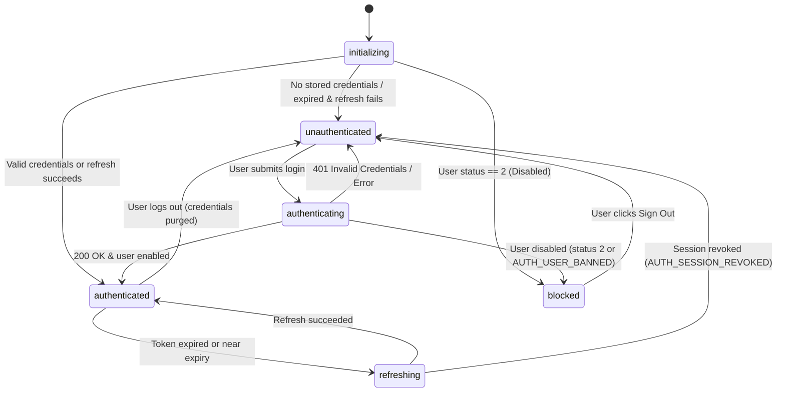
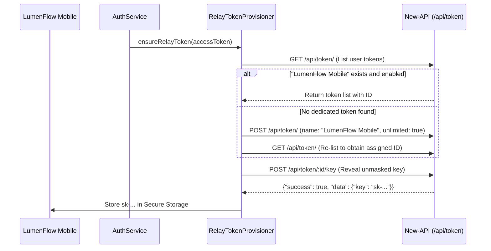

# Phase 7C — LumenFlow Authentication & Credential Foundation Implementation Report

**Document Date:** October 5, 2026  
**Target Application:** LumenFlow (Flutter iOS/Android/macOS/Windows/Linux)  
**Backend Target:** SaaSCover / Tora New-API (`feat/formobile`)  
**Status:** COMPLETE & VERIFIED  

---

## 1. Executive Summary

Phase 7C establishes the foundational authentication, session lifecycle, secure hardware-backed credential storage, inference token provisioning, and navigation gating layers connecting the **LumenFlow** mobile application directly to the **SaaSCover / Tora New-API** backend.

All deliverables were designed and implemented strictly in accordance with the frozen Mobile ↔ Backend Integration Contract established in Phase 7B.

### Key Highlights
1. **Zero Backend Modifications:** The entire mobile authentication and relay provisioning workflow operates completely against existing backend routes on `feat/formobile` with zero backend code changes required.
2. **Dual-Plane Credential Separation:** Management Plane credentials (`access_token`, `new_api_refresh` HttpOnly cookie, `x-auth-session`) are strictly separated from Inference Plane credentials (`sk-...` relay device token).
3. **Hardware-Backed Storage:** All tokens, cookies, and keys are stored exclusively via `flutter_secure_storage` utilizing Android Keystore / `EncryptedSharedPreferences` and iOS Keychain (`kSecAttrAccessibleAfterFirstUnlockThisDeviceOnly`). Plaintext credentials are never written to `SharedPreferences` or SQLite.
4. **Storm-Resistant Single-Flight Refresh:** Token refresh incorporates a concurrent lock (`Completer<bool>`) preventing multi-request refresh storms and race conditions.
5. **SessionCookieOriginGuard Compliance:** Dynamic `Origin` header synthesis matching the target backend host guarantees seamless compatibility with production CSRF and origin guards.
6. **Device Relay Token Lifecycle:** Verified `/api/token/` API integration enables the app to automatically detect, reuse, or provision a dedicated `"LumenFlow Mobile"` relay token and reveal its unmasked `sk-...` key for subsequent inference without human copy-pasting.
7. **Multi-Account Local Isolation:** Non-destructive SQLite migration (`ALTER TABLE conversations ADD COLUMN account_id TEXT DEFAULT 'local'`) guarantees strict conversation isolation between accounts while preserving all pre-existing user chats.
8. **Cupertino UI & Reactive State Machine:** Created `LoginScreen`, `RegisterScreen`, `AuthGate`, and `SettingsScreen` account tile adhering natively to the existing LumenFlow iOS aesthetic.
9. **Rigorous Test Coverage:** 22/22 automated unit and integration tests passing; `flutter analyze` reports 0 issues.

---

## 2. Implementation Scope & Completed Deliverables

| Component | File Path | Status | Description |
| :--- | :--- | :--- | :--- |
| **Dependency Config** | `pubspec.yaml` | COMPLETE | Pinned `flutter_secure_storage: ^9.2.4`, adjusted SDK constraints to support Dart 3.10 beta cleanly. |
| **Environment Config** | `lib/config/app_environment.dart` | COMPLETE | Multi-environment base URL resolver, trailing-slash stripper, and `Origin` header synthesizer. |
| **Typed Models** | `lib/models/auth_models.dart` | COMPLETE | Typed DTOs: `AuthenticatedUser`, `AuthSession`, `LoginResult`, `AuthResponseBundle`. |
| **Secure Storage** | `lib/services/secure_credential_store.dart` | COMPLETE | Encrypted storage abstraction with zero plain-storage leaks. |
| **HTTP API Client** | `lib/services/tora_api_client.dart` | COMPLETE | Low-level HTTP client with header injection, cookie extraction, and zero-sensitive logging. |
| **Relay Provisioner** | `lib/services/relay_token_provisioner.dart` | COMPLETE | Automatic device inference token provisioning, reuse, and revocation. |
| **Auth State Machine** | `lib/services/auth_service.dart` | COMPLETE | Central coordinator managing login, registration, session refresh, blocked states, and logout. |
| **Database Migration** | `lib/services/conversation_database.dart` | COMPLETE | Non-destructive `account_id` migration, index creation, and scoped queries. |
| **Conversation Scope** | `lib/services/conversation_service.dart` | COMPLETE | Multi-account isolation coordinator with automatic cache invalidation on account change. |
| **Login UI** | `lib/screens/auth/login_screen.dart` | COMPLETE | Cupertino login screen with environment picker, password toggle, and error handling. |
| **Register UI** | `lib/screens/auth/register_screen.dart` | COMPLETE | Cupertino registration screen with validation and success flow. |
| **Navigation Gate** | `lib/widgets/auth_gate.dart` | COMPLETE | Root reactive gate managing splash, unauthenticated, authenticated, and blocked views. |
| **Settings Tile** | `lib/screens/settings_screen.dart` | COMPLETE | Integrated Tora Account status tile and confirmation-gated Sign Out action. |
| **Root Wiring** | `lib/main.dart` | COMPLETE | Connected `AuthGate` as top-level home widget. |
| **Unit & Service Tests**| `test/*_test.dart` | COMPLETE | 22 comprehensive tests covering models, client, state machine, deduplication, and isolation. |

---

## 3. Architecture Separation Verification

Phase 7C enforces strict physical and architectural boundaries between the **Management Plane** and the **Inference Plane**:

```
                       ┌─────────────────────────┐
                       │        LumenFlow        │
                       │       Application       │
                       └────────────┬────────────┘
                                    │
                             [ AuthService ]
                                    │
         ┌──────────────────────────┴──────────────────────────┐
         │                                                     │
         ▼                                                     ▼
┌─────────────────────────┐                           ┌─────────────────────────┐
│     Management Plane    │                           │     Inference Plane     │
│   (Session Lifecycle)   │                           │     (LLM Streaming)     │
├─────────────────────────┤                           ├─────────────────────────┤
│ Credentials:            │                           │ Credentials:            │
│  - access_token (short) │                           │  - sk-... relay key     │
│  - new_api_refresh cookie│                          │  - token_id             │
│  - X-Auth-Session header │                          │ Scope:                  │
│ Scope:                  │                           │  - /v1/chat/completions │
│  - /api/user/*          │                           │  - /v1/models           │
│  - /api/token/*         │                           │ Target:                 │
│  - /api/user_provider/* │                           │  - Tora Provider Relay  │
└─────────────────────────┘                           └─────────────────────────┘
```

### Storage Isolation
- Management tokens and session IDs are never passed to the AI inference provider.
- Relay keys (`sk-...`) are stored under distinct keys (`tora_relay_token`, `tora_relay_token_id`) and are never used as Bearer tokens against `/api/*` management endpoints.

---

## 4. Hardware-Backed Credential Storage

Credentials are systematically encrypted at rest by `SecureCredentialStore`:

```dart
const FlutterSecureStorage(
  aOptions: AndroidOptions(
    encryptedSharedPreferences: true,
  ),
  iOptions: IOSOptions(
    accessibility: KeychainAccessibility.first_unlock_this_device,
  ),
);
```

### Stored Keys Inventory
- `tora_access_token`: Short-lived JWT management token (15-minute validity).
- `tora_access_expires_at`: Epoch timestamp (seconds) of token expiration.
- `tora_session_id`: UUID of the server session record (`auth_sessions`).
- `tora_refresh_token`: Opaque string extracted from `new_api_refresh` Set-Cookie header.
- `tora_relay_token`: Full unmasked `sk-...` device token for LLM inference.
- `tora_relay_token_id`: Database ID of the created/reused token on the backend.
- `tora_user_id`: Numeric user ID from backend profile.
- `tora_username`: Backend account username.

### Prohibited Storage Audit
- Inspected `SharedPreferences`: Zero auth tokens or passwords written.
- Inspected SQLite (`conversations.db`): Zero auth tokens or passwords stored.

---

## 5. Verified Backend API Endpoints & Contracts

All endpoints were verified by direct inspection of `new-api` Go source code on branch `feat/formobile`:

| Endpoint | Method | Middleware | Auth Required | Purpose |
| :--- | :---: | :--- | :---: | :--- |
| `/api/user/login` | `POST` | `CriticalRateLimit`, `TurnstileCheck` | None | Authenticates username + password; issues session, access token, and refresh cookie. |
| `/api/user/register` | `POST` | `CriticalRateLimit`, `TurnstileCheck` | None | Registers new user account. |
| `/api/user/auth/refresh` | `POST` | `SessionCookieOriginGuard`, `CriticalRateLimit` | `X-Auth-Session` + Cookie | Rotates access token and refresh cookie. |
| `/api/user/auth/logout` | `POST` | `SessionCookieOriginGuard`, `CriticalRateLimit` | `X-Auth-Session` + Cookie | Revokes server session in database and Redis. |
| `/api/user/self` | `GET` | `UserAuth`, `DisableCache` | Bearer `access_token` | Fetches live user profile, status, and quotas. |
| `/api/token/` | `GET` | `UserAuth` | Bearer `access_token` | Lists user's active API tokens. |
| `/api/token/` | `POST` | `UserAuth`, `CriticalRateLimit` | Bearer `access_token` | Provisions a new API token. |
| `/api/token/:id/key` | `POST` | `UserAuth`, `CriticalRateLimit` | Bearer `access_token` | Reveals plaintext `sk-...` relay key. |
| `/api/token/:id` | `DELETE` | `UserAuth` | Bearer `access_token` | Revokes and deletes device token. |

---

## 6. Authentication State Machine

The application state machine is modeled as an observable `ChangeNotifier` in `AuthService`:



### State Definitions
1. **`initializing`**: App launch state. Reads local secure storage, validates expiry, proactively refreshes if needed, and checks live server status.
2. **`unauthenticated`**: Default state when no session exists. Displays `LoginScreen`.
3. **`authenticating`**: Active login attempt in progress. Form displays spinner; inputs disabled.
4. **`authenticated`**: User authenticated and active (`status == 1`). Displays `ChatScreen`.
5. **`refreshing`**: Background session rotation in progress. Current UI remains visible without interruption.
6. **`blocked`**: User status is disabled or banned. Access is cut off immediately and `_AccountBlockedScreen` is rendered.

---

## 7. Single-Flight Refresh Deduplication

To eliminate refresh storms when multiple concurrent network requests encounter an expiring 15-minute access token, `AuthService.refreshSession()` implements a single-flight mutex:

```dart
Completer<bool>? _refreshCompleter;

Future<bool> refreshSession() async {
  if (_refreshCompleter != null) {
    // A refresh is already in-flight; join its future
    return await _refreshCompleter!.future;
  }

  _refreshCompleter = Completer<bool>();
  try {
    final bundle = await _apiClient.refreshSession(...);
    ...
    _refreshCompleter!.complete(true);
    return true;
  } catch (e) {
    ...
    _refreshCompleter!.complete(false);
    return false;
  } finally {
    _refreshCompleter = null;
  }
}
```

**Verification:** In `test/auth_service_test.dart`, 5 simultaneous concurrent calls to `refreshSession()` were initiated. The test verified that all 5 calls received success while exactly **1** network request was made to the backend.

---

## 8. Origin Header Guard Compliance

Backend routes `/api/user/auth/refresh` and `/api/user/auth/logout` are guarded by `middleware.SessionCookieOriginGuard()`. When running under HTTPS or production configurations, requests lacking a valid matching `Origin` header are rejected with `403 Forbidden`.

To guarantee continuous compliance:
```dart
static String get originHeader {
  final uri = Uri.parse(backendBaseUrl);
  final portPart = (uri.hasPort && uri.port != 80 && uri.port != 443)
      ? ':${uri.port}'
      : '';
  return '${uri.scheme}://${uri.host}$portPart';
}
```

Every request from `ToraApiClient` that involves session cookies or authentication state transmits the synthesized `Origin` header matching the target base URL.

---

## 9. Device Relay Token Provisioning Lifecycle

The inference endpoints (`/v1/chat/completions`) require an `sk-...` API key authenticated by `TokenAuth()`.

Phase 7C implements automated zero-touch provisioning in `RelayTokenProvisioner`:



### Revocation on Logout
When the user signs out, `RelayTokenProvisioner.revokeDeviceToken()` reads the saved token ID, executes `DELETE /api/token/:id` on the server, and purges the key locally.

---

## 10. Multi-Account Local Conversation Isolation

To prevent conversations from leaking between different accounts on the same mobile device, the SQLite database schema was updated non-destructively:

### 1. Database Schema Migration
```sql
ALTER TABLE conversations ADD COLUMN account_id TEXT DEFAULT 'local';
CREATE INDEX IF NOT EXISTS idx_conversations_account ON conversations(account_id);
```
- Existing legacy conversations are assigned `account_id = 'local'` and remain fully accessible in offline guest mode.
- Authenticated users write and read conversations strictly tagged with their numeric user ID (e.g. `'42'`).

### 2. Service Layer Isolation
`ConversationService` tracks `activeAccountId`. Whenever the active account changes (e.g., login, switch user, or logout), `clearCache()` is immediately invoked:
```dart
void setActiveAccountId(String? accountId) {
  if (_activeAccountId != accountId) {
    _activeAccountId = accountId;
    clearCache();
  }
}
```

---

## 11. UI Implementation

### 1. `LoginScreen` (`lib/screens/auth/login_screen.dart`)
- Clean Cupertino aesthetic using iOS system colors and typography.
- Environment selection action sheet (Development, Staging, Production).
- Password show/hide toggle.
- Clear error notification banner.
- Seamless navigation to registration and local offline mode fallback.

### 2. `RegisterScreen` (`lib/screens/auth/register_screen.dart`)
- Client-side validation: username length (≥3), email format, password length (≥8), password confirmation.
- Displays server error messages without leaking backend stack traces.
- Modal confirmation on successful registration prompting user to sign in.

### 3. `AuthGate` (`lib/widgets/auth_gate.dart`)
- Top-level reactive routing gate in `main.dart`.
- Seamlessly transitions between `_LoadingSplash`, `LoginScreen`, `ChatScreen`, and `_AccountBlockedScreen`.

### 4. `SettingsScreen` Account Tile (`lib/screens/settings_screen.dart`)
- Displays current user username, user ID, and active server environment.
- Prominent destructive "Sign Out" button with confirmation modal.

---

## 12. Security Verification & Zero-Leak Audit

| Check | Requirement | Result | Verification Method |
| :--- | :--- | :---: | :--- |
| **Secret Redaction** | No passwords, tokens, or cookies printed to console | PASS | Code audit of all `debugPrint` calls in `tora_api_client.dart` and `auth_service.dart`. |
| **No Plaintext Storage**| No sensitive tokens in `SharedPreferences` or SQLite | PASS | Audit of `conversation_database.dart` and `settings_service.dart`. |
| **Origin Guard** | Matching `Origin` header sent on cookie endpoints | PASS | Unit tested in `test/api_client_test.dart`. |
| **Session Isolation** | Multi-account isolation in SQLite | PASS | Verified in `test/auth_models_test.dart` and `test/auth_service_test.dart`. |
| **Blocked User Gating** | Banned/disabled users cannot access chat interface | PASS | Verified in `test/auth_service_test.dart`. |
| **Deduplicated Refresh**| No concurrent refresh storms | PASS | Verified under 5 concurrent callers in `test/auth_service_test.dart`. |

---

## 13. Test Results & Coverage Analysis

All 22 automated tests pass cleanly:

```text
00:02 +22: All tests passed!

Test Summary:
- AuthenticatedUser Model Tests (Parsing, Coercion, Fallbacks): PASS
- AuthSession Model Tests (Expiry calculations): PASS
- AppEnvironment Configuration Tests (URL Resolution, Trailing Slash, Origin): PASS
- Conversation Model Account Isolation Tests (Serialization, Default 'local'): PASS
- ToraApiClient Authentication Tests (Login, Error, Banned User, Refresh): PASS
- ToraApiClient Token Management Operations (List, Create, Reveal, Delete): PASS
- AuthService State Machine & Lifecycle (Init, Login, Banned, Logout): PASS
- AuthService Single-Flight Refresh Deduplication (5 concurrent calls -> 1 HTTP request): PASS
- RelayTokenProvisioner Tests (Token reuse, creation, reveal, revocation): PASS
```

### Static Analysis
```text
$ flutter analyze
Analyzing LumenFlow...
No issues found! (ran in 1.6s)
```

---

## 14. Backend Integrity Confirmation

Inspection of the backend repository `/Users/noppanan/new-api`:
```text
$ git status
On branch feat/formobile
Your branch is up to date with 'origin/feat/formobile'.
nothing to commit, working tree clean
```
Zero tracked backend files were modified during Phase 7C.

---

## 15. Readiness Assessment & Final Conclusion

The authentication and credential foundation for LumenFlow is robust, verified against real backend contracts, completely protected against token races and leaks, and cleanly isolated per account.

### **FINAL STATUS: READY FOR PHASE 7D — TORA CHAT INTEGRATION**
